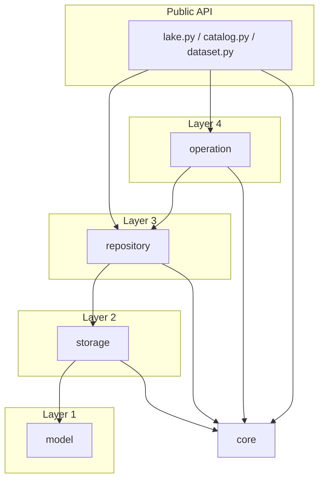

# Architecture

This document describes the layered architecture of `ftm-lakehouse`.

## Overview

The codebase follows a strict layered architecture with clear separation of concerns:

```
ftm_lakehouse/
├── lake.py              # Public convenience functions
├── catalog.py           # Catalog class (multi-dataset)
├── dataset.py           # Dataset class (single dataset)
│
├── model/               # Layer 1: Pure data structures
├── storage/             # Layer 2: Single-purpose storage interfaces
├── repository/          # Layer 3: Domain-specific storage combinations
├── operation/           # Layer 4: Multi-step workflows (internal)
│
└── core/                # Cross-cutting concerns
    └── conventions/     # Path and tag conventions
```

## Dependency Rules

Layers can only depend on layers below them:



## Layer 1: Model

Pure data structures with no dependencies. Pydantic models for serialization.

```
model/
  file.py        # File, Files - archived file metadata
  mapping.py     # DatasetMapping - CSV transformation configs
  job.py         # JobModel, DatasetJobModel - job execution tracking
  crud.py        # Crud, CrudAction, CrudResource - queue action payloads
  dataset.py     # CatalogModel, DatasetModel - catalog/dataset metadata
```

**Principles:**

- No behavior beyond validation
- No storage awareness
- No external dependencies (except pydantic, anystore.model)

See [Model Reference](reference/model.md) for API details.

## Layer 2: Storage

Single-purpose storage interfaces. Each store does ONE thing.

```
storage/
  base.py        # BaseStore - common store interface
  blob.py        # BlobStore - raw file bytes (content-addressed)
  file.py        # FileStore - JSON metadata files (File model)
  text.py        # TextStore - extracted text content
  parquet.py     # ParquetStore - Delta Lake statement parquet files
  journal.py     # JournalStore - SQL statement buffer (write-ahead log)
  tags.py        # TagStore - key-value freshness tracking
  queue.py       # QueueStore - CRUD action queue
  versions.py    # VersionStore - timestamped snapshots
```

**Principles:**

- Each store is independent - no cross-store awareness
- Operates on a single storage URI
- Returns/accepts model objects
- No business logic

See [Storage Reference](reference/storage.md) for API details.

## Layer 3: Repository

Domain-specific combinations of multiple stores. Each repository owns ONE domain concept.

```
repository/
  base.py        # BaseRepository - common repository interface
  archive.py     # ArchiveRepository - uses BlobStore + FileStore + TextStore
  entities.py    # EntityRepository - uses JournalStore + ParquetStore
  mapping.py     # MappingRepository - uses VersionStore
  job.py         # JobRepository - uses VersionStore
  factories.py   # Cached factory functions (get_archive, get_entities, etc.)
```

**Principles:**

- Combines stores for a single domain concept
- No cross-domain awareness (ArchiveRepository doesn't know about statements)
- Provides domain-specific operations
- Uses TagStore for freshness tracking

See [Repository Reference](reference/repository.md) for API details.

## Layer 4: Operation

Multi-step workflows that coordinate across repositories. This is where "action chains" are made explicit.

```
operation/
  base.py        # DatasetJobOperation - base class with freshness checks
  export.py      # ExportStatementsOperation, ExportEntitiesOperation, etc.
  crawl.py       # CrawlOperation - source → files → entities
  mapping.py     # MappingOperation - config → entities → journal
  optimize.py    # OptimizeOperation - compact Delta Lake parquet files
```

**Principles:**

- Operations are internal (not exposed to clients directly)
- Make multi-step processes explicit
- Handle freshness checks via `@skip_if_latest` decorator or `ensure_flush()`
- May span multiple repositories
- Create job run records for tracking

See [Operation Reference](reference/operation.md) for API details.

## Layer 5: Public API

The public interface that clients use.

```
lake.py          # Convenience functions: get_lakehouse(), get_dataset(), get_archive(), etc.
catalog.py       # Catalog class - multi-dataset management
dataset.py       # Dataset class - single dataset interface
```

**Key Classes:**

- **Catalog** - Multi-dataset management: `get_dataset()`, `list_datasets()`, `create_dataset()`
- **Dataset** - Single dataset interface with repository access: `archive`, `entities`, `mappings`, `jobs`

**Convenience functions in `lake.py`:**

- `get_lakehouse()` - Get the catalog
- `get_dataset()` / `ensure_dataset()` - Get or create a dataset
- `get_entities()` / `get_archive()` / `get_mappings()` - Repository shortcuts

See [Lake Reference](reference/lake.md) for API details.

## Core

Cross-cutting concerns used by all layers.

```
core/
  settings.py           # Configuration from environment (Settings, ApiSettings)
  config.py             # Config loading utilities (load_config)
  conventions/
    path.py             # Path patterns (archive/, mappings/, exports/, etc.)
    tag.py              # Tag keys (journal/last_updated, exports/statements, etc.)
```

**Principles:**

- No business logic
- Pure utilities and configuration
- Can be used by any layer

**Additional Modules:**
```
helpers/                # Domain-specific utilities
  file.py               # File handling (mime_to_schema, etc.)
  statements.py         # Statement pack/unpack for journal
  dataset.py            # Dataset resource builders
  serialization.py      # Model serialization utilities
```

## Usage Examples

For detailed usage examples, see:

- [Quickstart](quickstart.md) - Getting started guide
- [Working with Entities](usage/entities.md) - Entity/statement operations
- [Working with Files](usage/archive.md) - File archive operations
- [Working with Mappings](usage/mappings.md) - CSV mapping operations

## File Layout

Complete directory structure:

```
ftm_lakehouse/
├── __init__.py              # Exports: Catalog, Dataset, get_lakehouse, etc.
├── lake.py                  # get_lakehouse(), get_dataset(), ensure_dataset()
├── catalog.py               # Catalog class
├── dataset.py               # Dataset class
├── cli.py                   # CLI entry point (typer-based)
├── util.py                  # General utilities
├── exceptions.py
│
├── model/
│   ├── __init__.py          # Exports all models
│   ├── file.py              # File, Files
│   ├── mapping.py           # DatasetMapping
│   ├── job.py               # JobModel, DatasetJobModel
│   ├── crud.py              # Crud, CrudAction, CrudResource
│   └── dataset.py           # CatalogModel, DatasetModel
│
├── storage/
│   ├── __init__.py          # Exports all stores
│   ├── base.py              # BaseStore
│   ├── blob.py              # BlobStore
│   ├── file.py              # FileStore
│   ├── text.py              # TextStore
│   ├── parquet.py           # ParquetStore
│   ├── journal.py           # JournalStore, JournalWriter
│   ├── tags.py              # TagStore
│   ├── queue.py             # QueueStore
│   └── versions.py          # VersionStore
│
├── repository/
│   ├── __init__.py          # Exports all repositories
│   ├── base.py              # BaseRepository
│   ├── archive.py           # ArchiveRepository
│   ├── entities.py          # EntityRepository
│   ├── mapping.py           # MappingRepository
│   ├── job.py               # JobRepository
│   └── factories.py         # Cached factory functions
│
├── operation/
│   ├── __init__.py          # Exports all operations
│   ├── base.py              # DatasetJobOperation
│   ├── export.py            # Export operations
│   ├── crawl.py             # CrawlOperation
│   ├── mapping.py           # MappingOperation
│   └── optimize.py          # OptimizeOperation
│
├── helpers/
│   ├── file.py              # File utilities
│   ├── statements.py        # Statement pack/unpack
│   ├── dataset.py           # Resource builders
│   └── serialization.py     # Model serialization
│
├── logic/
│   ├── __init__.py
│   ├── entities.py          # Entity logic
│   └── mappings.py          # Mapping logic
│
├── api/
│   ├── __init__.py
│   ├── main.py              # FastAPI app
│   ├── auth.py              # Authentication
│   └── util.py              # API utilities
│
└── core/
    ├── __init__.py          # Exports: Settings, load_config
    ├── settings.py          # Settings, ApiSettings
    ├── config.py            # load_config()
    └── conventions/
        ├── __init__.py      # Exports: path, tag modules
        ├── path.py          # Path conventions
        └── tag.py           # Tag keys
```

## Key Principles

1. **Each storage does ONE thing** - no cross-storage awareness
2. **Repositories combine storages** - for ONE domain concept
3. **Operations are explicit workflows** - no hidden side effects
4. **Freshness is explicit** - checked in operations, not decorators
5. **Public API is simple** - delegates to repositories/operations
6. **`__init__.py` exports only** - no logic in init files
7. **Strict layer dependencies** - upper layers depend on lower layers only
