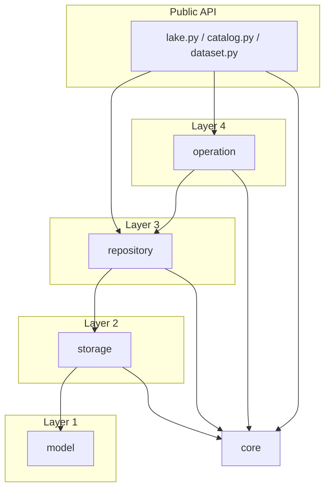

# Architecture

This document describes the layered architecture of `ftm-lakehouse`.

## Overview

The codebase follows a strict layered architecture with clear separation of concerns:

```
ftm_lakehouse/
├── lake.py              # Public convenience functions
├── catalog.py           # Catalog class (multi-dataset)
├── dataset.py           # Dataset class (single dataset)
│
├── model/               # Layer 1: Pure data structures
├── storage/             # Layer 2: Single-purpose storage interfaces
├── repository/          # Layer 3: Domain-specific storage combinations
├── operation/           # Layer 4: Multi-step workflows (internal)
│
└── core/                # Cross-cutting concerns
    └── conventions/     # Path and tag conventions
```

## Dependency Rules

Layers can only depend on layers below them:


```mermaid
flowchart TD
    subgraph Public["Public API"]
        API["lake.py / catalog.py / dataset.py"]
    end

    subgraph Layer4["Layer 4"]
        OP[operation]
    end

    subgraph Layer3["Layer 3"]
        REPO[repository]
    end

    subgraph Layer2["Layer 2"]
        STORE[storage]
    end

    subgraph Layer1["Layer 1"]
        MODEL[model]
    end

    CORE[core]

    API --> REPO
    API --> OP
    API --> CORE
    OP --> REPO
    OP --> CORE
    REPO --> STORE
    REPO --> CORE
    STORE --> MODEL
    STORE --> CORE
```

## Layer 1: Model

Pure data structures with no dependencies. Pydantic models and lightweight typed primitives.

```
model/
  file.py        # File, Files - archived file metadata
  mapping.py     # DatasetMapping - CSV transformation configs
  job.py         # JobModel, DatasetJobModel - job execution tracking
  dataset.py     # CatalogModel, DatasetModel - catalog/dataset metadata
  statement.py   # SHARDED_SCHEMA (pyarrow) + TABLE (SQLAlchemy) +
                 # StatementRow (NamedTuple) – schema for the parquet
                 # statement store and shared currency between buffer
                 # and writer.
```

**Principles:**

- No behavior beyond validation
- No storage awareness
- No external dependencies (except pydantic, pyarrow, sqlalchemy, anystore.model)

See [Model Reference](reference/model.md) for API details.

## Layer 2: Storage

Single-purpose storage interfaces. Each store does ONE thing.

```
storage/
  parquet.py         # ParquetStore - Delta Lake statement store
                     #   .append (sorted per-shard write)
                     #   .merge (per-partition dedup + tombstone reap)
                     #   .compact (file bin-pack)
                     #   .vacuum (delete obsolete files)
  journal/
    base.py          # BaseJournalStore + JournalRow
                     # .flush()             – yields raw JournalRow
                     # .flush_statements()  – yields StatementRow (unpacked)
    sql.py           # SqlJournalStore (sqlite / psql)
    api.py           # ApiJournalStore (HTTP forwarding)
  tags.py            # TagStore – key-value freshness tracking
  versions.py        # VersionStore – timestamped snapshots
```

Blob, file metadata, and text storage are handled directly by repositories using `anystore.Store` instances via `get_store()`, eliminating a layer of indirection.

### Sharded append-only pattern

The parquet statement store is partitioned by `(shard, bucket, origin)`:

- `shard` – `hash(entity_id) % shards` (the dataset's configured shard count), hex-padded
- `bucket` – coarse FtM schema group (thing / interval / document / page / pages / mention)
- `origin` – caller-supplied source tag

Each row carries `first_seen`, `last_seen`, `fragment`, and `deleted_at` directly in the parquet schema (no separate translog). The live `statement` query view is a plain `WHERE deleted_at IS NULL` scan – **no read-time dedupe** – so a filter (`schema` / `prop` / `entity_id`) pushes straight through to DuckDB's per-file statistics.

Writes are **append-only**: `append` sorts a per-shard batch by `(bucket, origin, entity_id, fragment, prop, id, last_seen DESC)` and writes one parquet file per `(shard, bucket, origin)` partition. Duplicates and tombstones land as additional rows.

**Correctness assumes an optimized store.** Dedupe, fragment supersession, `first_seen`/`last_seen` folding, and tombstone reaping all happen in `merge`; between a write and the next merge, reads can surface duplicate ids and rows whose delete has not been applied. Run `optimize` before you query or export. `merge` routes every row into one of two isolated branches on the `fragment` column (empty-string sentinel, never NULL):

- **non-fragment** (`fragment = ''`, the default): content-addressed dedup – latest `last_seen` per statement `id` wins; distinct ids never interact. Scoped per `(shard, bucket, origin)` partition, so the *same* statement observed under two origins is kept once per origin (merge cannot cross origin partitions).
- **fragment-bearing** (`fragment != ''`): supersession per `(origin, entity_id, prop, fragment)` group – every row tied at the group's max `last_seen` survives (the latest emission, multi-valued props included), older emissions go. See [Fragment Supersession](usage/entities.md#fragment-supersession) for semantics and the producer contract.

The async `optimize` operation produces this canonical state by running the three storage primitives in order, each acquiring the dataset-wide `.LOCK` so they don't race with each other or with appends:

| Step | Cost | What it does |
|------|------|--------------|
| `merge()` | expensive | Per-partition rewrite: keep latest row per id (`ROW_NUMBER`) / latest emission per fragment group, fold `first_seen` to min, drop tombstones past grace |
| `compact()` | cheap | Delta `OPTIMIZE compact` per partition – bin-packs small files |
| `vacuum()` | cheap | Delta `VACUUM` – delete files no longer referenced in the Delta log |

#### Sharding – why, and how many shards

The `shard` partition key is the unit that keeps per-partition working sets bounded, independent of total dataset size. Everything expensive in the lakehouse operates one `(shard, bucket)` partition at a time:

- **Writes:** statement rows arrive shard-sorted from the journal (the journal table is indexed by shard), and `append` buffers at most one shard's batch in memory before writing it out.
- **Reads:** statement queries iterate `(shard, bucket)` partitions in Python and push `WHERE shard = ?` into DuckDB; the live view is a plain scan, so filters push to file statistics and a full-store `ORDER BY entity_id` stays bounded to one partition. Single-entity lookups hash the entity id and scan just its own shard.
- **Optimize:** the merge rewrite materializes one partition at a time – its memory and rewrite cost scale with the largest partition, not the whole table.

Sharding is a trade-off, not a free win: every shard multiplies the partition count (`shard × bucket × origin`), which means more small parquet files, more Delta log metadata, and more per-partition query iterations. For small and medium datasets that overhead costs more than the bounded working sets gain.

That's why the **default is `0`** – a single shard (`shard <= 1` collapses to one `"0"` partition). The default is hardcoded, deliberately not an environment setting: the shard count is per-dataset configuration, recorded in the dataset's `config.yml` at creation (e.g. `ensure_dataset("big_leak", shards=8)`), and every reader and writer resolves it from there – a process running with a different environment cannot mis-shard an existing dataset. Don't configure shards unless the dataset is huge: from roughly tens of millions of statements upward, set `shards: 8` (or more, scaling with entity count) so merge rewrites stay bounded. The shard count is **immutable after the first write** – changing it requires a full rewrite of the statement store, so size it for the data you expect, not the data you have on day one.

**Principles:**

- Each store is independent – no cross-store awareness
- Operates on a single storage URI
- Returns/accepts model objects
- No business logic

See [Storage Reference](reference/storage.md) for API details.

## Layer 3: Repository

Domain-specific combinations of multiple stores. Each repository owns ONE domain concept.

```
repository/
  base.py        # BaseRepository - common repository interface
  archive.py     # ArchiveRepository - blobs, file metadata, text (via get_store)
  entities.py    # EntityRepository - uses JournalStore + ParquetStore
  documents.py   # DocumentRepository - compiled document metadata CSV + diffs
  mapping.py     # MappingRepository - uses VersionStore
  job.py         # JobRepository - job tracking (via get_store)
  factories.py   # Cached factory functions (get_archive, get_entities, etc.)
```

**Principles:**

- Combines stores for a single domain concept
- May use `get_store()` directly for simple storage needs (blobs, metadata JSON)
- No cross-domain awareness (ArchiveRepository doesn't know about statements)
- Provides domain-specific operations
- Uses TagStore for freshness tracking

See [Repository Reference](reference/repository.md) for API details.

## Layer 4: Operation

Multi-step workflows that coordinate across repositories. This is where "action chains" are made explicit.

```
operation/
  base.py          # DatasetJobOperation - base class with freshness checks
  export.py        # ExportOperation - all exports, dispatched by ExportKind
  crawl.py         # CrawlOperation - source → files → entities
  mapping.py       # MappingOperation - config → entities → journal
  maintenance.py   # OptimizeOperation - merge + compact + vacuum in one pass
  make.py          # MakeOperation - flush + all exports + index
  download.py      # DownloadArchiveOperation
```

**Principles:**

- Operations are internal (not exposed to clients directly)
- Make multi-step processes explicit
- Handle freshness checks via `@skip_if_latest` decorator or `ensure_flush()`
- May span multiple repositories
- Create job run records for tracking

See [Operation Reference](reference/operation.md) for API details.

## Layer 5: Public API

The public interface that clients use.

```
lake.py          # Convenience functions: get_lakehouse(), get_dataset(), get_archive(), etc.
catalog.py       # Catalog class - multi-dataset management
dataset.py       # Dataset class - single dataset interface
```

**Key Classes:**

- **Catalog** - Multi-dataset management: `get_dataset()`, `list_datasets()`, `create_dataset()`
- **Dataset** - Single dataset interface with repository access: `archive`, `entities`, `mappings`, `jobs`

**Convenience functions in `lake.py`:**

- `get_lakehouse()` - Get the catalog
- `get_dataset()` / `ensure_dataset()` - Get or create a dataset
- `get_entities()` / `get_archive()` / `get_mappings()` - Repository shortcuts

See [Lake Reference](reference/lake.md) for API details.

## Core

Cross-cutting concerns used by all layers.

```
core/
  settings.py           # Configuration from environment (Settings, ApiSettings)
  config.py             # Config loading utilities (load_config)
  conventions/
    path.py             # Path patterns (archive/, mappings/, exports/, etc.)
    tag.py              # Tag keys (journal/last_updated, exports/statements, etc.)
```

**Principles:**

- No business logic
- Pure utilities and configuration
- Can be used by any layer

**Additional Modules:**
```
helpers/                # Domain-specific utilities
  file.py               # File handling (mime_to_schema, etc.)
  statements.py         # Statement pack/unpack for journal
  dataset.py            # Dataset resource builders
  serialization.py      # Model serialization utilities
```

## Usage Examples

For detailed usage examples, see:

- [Quickstart](quickstart.md) - Getting started guide
- [Working with Entities](usage/entities.md) - Entity/statement operations
- [Working with Files](usage/archive.md) - File archive operations
- [Working with Mappings](usage/mappings.md) - CSV mapping operations

## File Layout

Complete directory structure:

```
ftm_lakehouse/
├── __init__.py              # Exports: Catalog, Dataset, get_lakehouse, etc.
├── lake.py                  # get_lakehouse(), get_dataset(), ensure_dataset()
├── catalog.py               # Catalog class
├── dataset.py               # Dataset class
├── util.py                  # General utilities
├── exceptions.py
│
├── cli/                     # Typer-based CLI (sub-typer groups)
│   ├── __init__.py          # Main app + ls/datasets + DatasetContext
│   ├── archive.py           # `archive` group
│   ├── entities.py          # `entities` group (iterate/stream/import)
│   ├── statements.py        # `statements` group (iterate/stream/import)
│   ├── mappings.py          # `mappings` group
│   ├── operations.py        # `operations` group + top-level `make`
│   └── zfs.py               # `zfs` group (agent/init)
│
├── adapters/                # ftmq-compatible adapters on top of EntityRepository
│   └── fragments.py         # Drop-in for ftmq.store.fragments
│
├── model/
│   ├── __init__.py          # Exports all models
│   ├── file.py              # File, Files
│   ├── mapping.py           # DatasetMapping
│   ├── job.py               # JobModel, DatasetJobModel
│   └── dataset.py           # CatalogModel, DatasetModel
│
├── storage/
│   ├── __init__.py          # Exports all stores
│   ├── parquet.py           # ParquetStore (append / merge / compact / vacuum)
│   ├── journal/
│   │   ├── base.py          # BaseJournalStore + JournalRow + flush_statements
│   │   ├── sql.py           # SqlJournalStore
│   │   └── api.py           # ApiJournalStore (HTTP forwarding)
│   ├── tags.py              # TagStore
│   ├── queue.py             # QueueStore
│   └── versions.py          # VersionStore
│
├── repository/
│   ├── __init__.py          # Exports all repositories
│   ├── base.py              # BaseRepository
│   ├── archive.py           # ArchiveRepository
│   ├── entities.py          # EntityRepository
│   ├── mapping.py           # MappingRepository
│   ├── job.py               # JobRepository
│   └── factories.py         # Cached factory functions
│
├── operation/
│   ├── __init__.py          # Exports all operations
│   ├── base.py              # DatasetJobOperation
│   ├── export.py            # Export operations
│   ├── crawl.py             # CrawlOperation
│   ├── mapping.py           # MappingOperation
│   ├── maintenance.py       # OptimizeOperation (merge + compact + vacuum)
│   ├── make.py              # MakeOperation
│   └── download.py          # DownloadArchiveOperation
│
├── helpers/
│   ├── file.py              # File utilities
│   ├── statements.py        # Statement pack/unpack
│   ├── dataset.py           # Resource builders
│   └── serialization.py     # Model serialization
│
├── logic/
│   ├── __init__.py
│   ├── entities.py          # Entity logic
│   ├── parquet.py           # Translog-aware DuckDB query helpers
│   └── mappings.py          # Mapping logic
│
├── api/
│   ├── __init__.py
│   ├── main.py              # FastAPI app
│   ├── auth.py              # Authentication
│   └── util.py              # API utilities
│
└── core/
    ├── __init__.py          # Exports: Settings, load_config
    ├── settings.py          # Settings, ApiSettings
    ├── config.py            # load_config()
    └── conventions/
        ├── __init__.py      # Exports: path, tag modules
        ├── path.py          # Path conventions
        └── tag.py           # Tag keys
```

## Key Principles

1. **Each storage does ONE thing** - no cross-storage awareness
2. **Repositories combine storages** - for ONE domain concept
3. **Operations are explicit workflows** - no hidden side effects
4. **Freshness is explicit** - checked in operations, not decorators
5. **Public API is simple** - delegates to repositories/operations
6. **`__init__.py` exports only** - no logic in init files
7. **Strict layer dependencies** - upper layers depend on lower layers only
