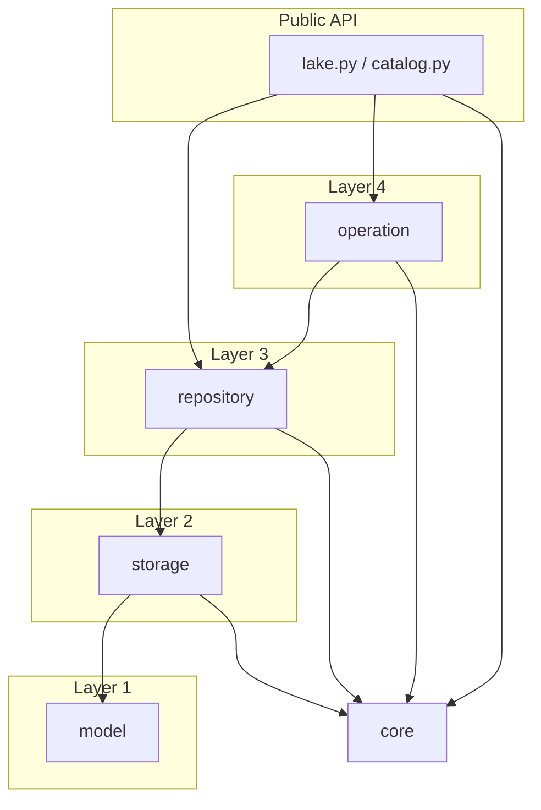
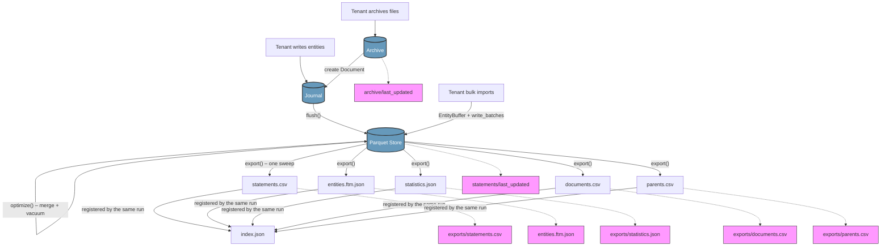

# Architecture

`ftm-lakehouse` is built in strict layers – see [Module Layout](#module-layout) for the full tree.

## Dependency Rules

Layers can only depend on layers below them:


```mermaid
flowchart TD
    subgraph Public["Public API"]
        API["lake.py / catalog.py"]
    end

    subgraph Layer4["Layer 4"]
        OP[operation]
    end

    subgraph Layer3["Layer 3"]
        REPO[repository]
    end

    subgraph Layer2["Layer 2"]
        STORE[storage]
    end

    subgraph Layer1["Layer 1"]
        MODEL[model]
    end

    CORE[core]

    API --> REPO
    API --> OP
    API --> CORE
    OP --> REPO
    OP --> CORE
    REPO --> STORE
    REPO --> CORE
    STORE --> MODEL
    STORE --> CORE
```

Below the layers, `util.py` holds dependency-light primitives importable from anywhere, and `helpers/` the FtM-domain building blocks, which never import `model/` or higher.

## Layer 1: Model

Pure data structures: Pydantic models, the Arrow schemas of the statement store (`JOURNAL_SCHEMA`, `SHARDED_SCHEMA`) and `LakehouseStatement` – ftmq's `LakeStatement` plus `deleted_at` and `role`.

- No behavior beyond validation
- No storage awareness
- No external dependencies except pydantic, pyarrow, sqlalchemy and `anystore.model`

See [Model Reference](reference/model.md).

## Layer 2: Storage

Single-purpose stores, each doing one thing: the `ParquetStore` (Delta Lake statement store), the SQL journal (write-ahead log), the `TagStore` (freshness) and the `VersionStore` (timestamped snapshots). Blobs, file metadata and text are plain `anystore.Store` instances (`get_store()`) used by the repositories.

- Each store is independent and operates on a single storage URI
- No business logic

See [Storage Reference](reference/storage.md).

### Sharded append-only pattern

The parquet statement store is partitioned by `(shard, bucket, origin)`:

- `shard` – `hash(entity_id) % shards` (the dataset's configured count), hex-padded
- `bucket` – coarse FtM schema group (thing / interval / document / page / mention)
- `origin` – caller-supplied source tag

Each row carries `first_seen`, `last_seen`, `fragment`, `role` and `deleted_at` in the parquet schema. Writes are **append-only**: `append` derives each row's `shard` from its `entity_id` and writes one unsorted file per partition the batch spans; duplicates and tombstones land as additional rows. Producers hand over rows without a shard key (`JOURNAL_SCHEMA`), so the partition always follows the count of the store that writes it.

**Reads are correct on any store; `merge` is compaction.** Dedupe, fragment supersession, `first_seen`/`last_seen` folding and tombstone hiding are one DuckDB query, `_dedupe_sql`, which a read runs over a dirty partition and `merge` runs to rewrite it. A read therefore returns the same rows before and after a merge; the merge changes the cost (a partition of merge output alone is a plain `deleted_at IS NULL` scan whose filters push down to file statistics) and the disk (tombstones past grace and the rows they shadow go). The query routes every row into one of two branches on `fragment` (empty-string sentinel, never NULL):

- **non-fragment** (`fragment = ''`): latest `last_seen` per statement `id` wins. Scoped per partition, so the same statement under two origins is kept once per origin.
- **fragment-bearing** (`fragment != ''`): supersession per `(origin, entity_id, prop, fragment, role)` group – every row tied at the group's latest `last_seen` survives, older emissions go. See [Fragment Supersession](usage/entities.md#fragment-supersession).

`role` – who asserted a statement, against `origin`'s where – is in the window key of both branches: two roles asserting identical content keep two rows, one role re-asserting collapses. NULL roles dedupe against each other. `first_seen` folds per `(id, role)`, so a role's first assertion keeps its own date for diffs. See [The Role Field](usage/entities.md#the-role-field).

The async `optimize` operation runs two storage primitives:

| Step | Cost | What it does |
|------|------|--------------|
| `merge()` | expensive | Per-partition rewrite: latest row per `(id, role)` / latest emission per fragment group, `first_seen` folded to min, tombstones past grace dropped |
| `vacuum()` | cheap | Delta `VACUUM` – delete files the log no longer references |

`merge` takes the merge lock (`.LOCK-MERGE`), which the export sweep takes too, so an optimize never vacuums files a running sweep reads. Appends don't wait for it – a merge removes exactly the files it read, an append only adds – so ingest flows through a long merge. The in-place rewrites (re-shard, `delete_origin`, schema changes, `vacuum`) take the exclusive `.LOCK`, and appends back off while it is held.

A merge loads one Delta snapshot, reads each dirty partition's files with `read_parquet`, writes one merged file with DuckDB's `COPY` and commits in batches of 64 partitions; a failed run keeps the batches it committed, and the next run picks up the rest. A run that committed anything ends with a Delta checkpoint, so the next load doesn't replay the removed files. Partitions merge in parallel processes (`LAKEHOUSE_WORKERS`), each worker getting its partition's files from the parent. Each worker's share of `LAKEHOUSE_DUCKDB_MEMORY_LIMIT` has to cover the heaviest partition – see [Sizing parallel workers](deployment/configuration.md#sizing-parallel-workers); a partition too large to merge in acceptable time wants more shards.

The Delta table is created with `delta.deletedFileRetentionDuration = 1 hour` and `delta.logRetentionDuration = 1 day` (the `migrate_parquet_table_properties` migration sets them on older stores) – with the Delta defaults the log of a frequently merged store outgrows its data.

#### Sharding – why, and how many shards

Everything expensive runs one `(shard, bucket)` pair at a time, so the shard count bounds the working set:

- **Writes:** `append` writes one file per `(shard, bucket, origin)` partition a batch spans – bigger batches cost fewer files.
- **Reads:** statement queries run per pair over that pair's files, taken from a Delta snapshot each process keeps and advances incrementally, so a read never replays the log. A lookup by entity id reads only its own shard. A sorted or sliced query reads every pair it can touch in one query; `stats()` and the raw-SQL CLI use `delta_scan` views.
- **Optimize and export:** a worker holds one partition (merge) or one pair (export sweep) at a time, so memory scales with the largest partition, not the table.

Every shard multiplies the partition count (`shard × bucket × origin`) – more small files, more log metadata, more per-pair queries – which costs small and medium datasets more than it saves. The **default is `0`**, a single shard `"0"` (`shards <= 1`). The count is per-dataset config, recorded in `config.yml` at creation (`ensure_dataset("big_leak", shards=8)`), not an environment setting. From roughly tens of millions of statements, configure `8` or more, sized for the data you expect: changing it later rewrites every partition – see [Re-sharding](#re-sharding-an-existing-dataset).

#### Re-sharding an existing dataset

`ShardOperation` (`ftm-lakehouse -d <dataset> maintenance shard --shards <n>`, or `operation.shard(dataset, shards)`) drains the journal, rewrites the statement store onto the new count and then records it in `config.yml` – the config last, since every other process resolves the layout from it.

Only `shard` moves, so the rewrite runs one streamed `write_deltalake` per `(bucket, origin)` group, replacing the group's partitions in one commit, read from one snapshot. Rows are neither deduped nor sorted, so every partition comes out dirty: run `optimize` afterwards. Re-running is safe – a row's target shard depends only on its `entity_id` and the count.

Caveats:

- `.LOCK` holds off parquet appends but not journal writes: rows flushed under the old count after the rewrite land in the wrong partition – **run it with writers stopped**.
- The operation skips when `config.yml` already names the target count; a config edited by hand to a count the store was never rewritten for needs `--force`.

## Layer 3: Repository

Domain-specific combinations of stores, one domain concept each: `EntityRepository` (journal + parquet store; `ApiEntityRepository` in api mode), `ArchiveRepository` (content-addressed files), `DocumentRepository` (the documents csv), `ArtifactsRepository` (export artifacts and their diff series) and `JobRepository`. All are resolved through the cached factories in `repository/factories.py`.

- No cross-domain awareness (`ArchiveRepository` doesn't know about statements)
- May use `get_store()` directly for simple storage
- Freshness through the `TagStore`

See [Repository Reference](reference/repository.md).

## Layer 4: Operation

Multi-step workflows across repositories: `ExportOperation`, `CrawlOperation`, `OptimizeOperation`, `ShardOperation`, `MigrateOperation`, `MakeOperation`, `DownloadArchiveOperation`.

- Each declares a `target` tag and the `dependencies` it is fresh against; `DatasetJobOperation` skips a run whose target is newer than its dependencies
- Each run is recorded as a job

See [Operation Reference](reference/operation.md).

## Layer 5: Public API

Repositories are the dataset handle – every path addressing a dataset shares one cached instance:

```python
from ftm_lakehouse import ensure_dataset, get_entities, get_archive

ensure_dataset("my_data", shards=8, compression="zst")   # config recorded at creation
entities = get_entities("my_data")                       # EntityRepository
archive = get_archive("my_data")                         # ArchiveRepository
```

**Config lifecycle** is module functions in `catalog.py`: `ensure_dataset()` (get-or-create), `update_dataset()` (merge-write plus versioned snapshot; clears the factory caches), `get_dataset_model()`, `get_dataset_index()`, `dataset_exists()`. Repositories snapshot `shards` and `compression` at construction, so layout-affecting config must be set at creation.

**Multi-dataset concerns** go through the slim `Catalog` (`get_lakehouse()`): `list_datasets()`, `dataset_uri(name)`.

See [Lake Reference](reference/lake.md).

## Core

Cross-cutting configuration and utilities, used by every layer, with no business logic: settings, config loading, path and tag conventions, the outgoing api client, Arrow IPC framing and ZFS tuning.

## Usage Examples

- [Quickstart](quickstart.md)
- [Working with Entities](usage/entities.md)
- [Working with Files](usage/archive.md)

## Module Layout

```
ftm_lakehouse/
├── lake.py                  # get_lakehouse(), repository shortcuts
├── catalog.py               # config lifecycle fns + slim Catalog
├── util.py                  # dependency-light primitives (validation, checksums, process_map)
├── exceptions.py
│
├── model/                   # Layer 1: Pure data structures
│   ├── dataset.py           # DatasetModel – dataset metadata / config
│   ├── file.py              # File metadata
│   ├── job.py               # Job models
│   └── statement.py         # JOURNAL / SHARDED_SCHEMA, LakehouseStatement, statements_to_arrow
│
├── storage/                 # Layer 2: Single-purpose storage interfaces
│   ├── journal/             # SQL write-ahead log (base.py, sql.py, api.py)
│   ├── parquet.py           # ParquetStore (Delta Lake: append, merge, vacuum, shard, sweep)
│   ├── tags.py              # TagStore (freshness)
│   └── versions.py          # VersionStore (config / index snapshots)
│
├── repository/              # Layer 3: Domain-specific storage combinations
│   ├── base.py              # DatasetHandle, dataset_uri(), ensure_zfs()
│   ├── factories.py         # cached single instantiation path
│   ├── entities/            # EntityRepository (main.py), ApiEntityRepository (api.py)
│   ├── archive.py           # ArchiveRepository
│   ├── documents.py         # DocumentRepository
│   ├── artifacts.py         # export artifacts, their writers and diff series
│   └── job.py               # JobRepository
│
├── operation/               # Layer 4: Multi-step workflow operations
│   ├── base.py              # DatasetJobOperation (freshness target / dependencies)
│   ├── factories.py         # export(), optimize(), shard(), migrate(), make(), ...
│   ├── export.py            # ExportOperation (one sweep, every artifact)
│   ├── maintenance.py       # OptimizeOperation, ShardOperation, MigrateOperation
│   ├── migrations.py        # registered store migrations
│   ├── make.py              # MakeOperation (flush + export)
│   ├── crawl.py             # CrawlOperation
│   └── download.py          # DownloadArchiveOperation
│
├── logic/                   # Business logic, no storage
│   ├── entities/            # aggregate.py, buffer.py, explode.py, stats.py
│   ├── parquet.py           # DuckDB view / merge / shard SQL builders
│   └── path.py              # path primitives for the conventions
│
├── helpers/                 # FtM-domain building blocks
│   ├── file.py              # file → entity construction, FolderTree
│   ├── schema.py            # schema introspection
│   ├── shards.py            # entity_shard
│   ├── statements.py        # statement row identity, BASE_ID stub
│   └── serialization.py     # model (de)serialization
│
├── api/                     # FastAPI REST API
│   ├── main.py              # app factory, blob mounting
│   ├── dependencies.py      # DatasetName / Entities / Shards / Journal deps
│   └── routes/              # entities.py, journal.py, operations.py, ensure.py
│
├── cli/                     # Typer CLI (sub-typer groups)
│   ├── __init__.py          # main app, contexts, ls / datasets / configure
│   ├── io.py                # shared bulk-import loops
│   ├── entities.py          # entities iterate / stream / import
│   ├── statements.py        # statements iterate / stream / import / sql
│   ├── archive.py           # archive get / head / ls / download
│   ├── maintenance.py       # make, export, maintenance flush / optimize / shard / migrate / unlock
│   ├── crawl.py             # crawl
│   └── zfs.py               # zfs init
│
└── core/                    # Cross-cutting concerns
    ├── settings.py          # LAKEHOUSE_* env configuration
    ├── config.py            # config.yml loading
    ├── api.py               # outgoing lakehouse-api client, no_api guard
    ├── arrow.py             # Arrow IPC framing for the api wire
    ├── conventions/         # path.py, tag.py
    └── zfs.py               # ZFS tuning + zfs-agent caller
```

## Storage Layout & Tags

The on-disk layout of a dataset and the freshness tags are documented in [Conventions](conventions.md).

## Dependency Chain


```mermaid
flowchart TD
    A[Tenant writes entities] --> B[(Journal)]
    A2[Tenant archives files] --> AR[(Archive)]
    AR -.-> T0[archive/last_updated]
    AR --> |"create Document"| B

    B --> |"flush()"| C[(Parquet Store)]
    A3[Tenant bulk imports] --> |"EntityBuffer + write_batches"| C

    C --> |"optimize() – merge + vacuum"| C

    C --> |"export() – one sweep"| D[statements.csv]
    C --> |"export()"| E[entities.ftm.json]
    C --> |"export()"| F[statistics.json]
    C --> |"export()"| H[documents.csv]
    C --> |"export()"| P[parents.csv]
    D & E & F & H & P --> |"registered by the same run"| G[index.json]

    C -.-> T2[statements/last_updated]
    D -.-> T3[exports/statements.csv]
    E -.-> T4[entities.ftm.json]
    F -.-> T5[exports/statistics.json]
    H -.-> T6[exports/documents.csv]
    P -.-> T7[exports/parents.csv]

    classDef tag fill:#f9f,stroke:#333,stroke-width:1px
    classDef storage fill:#69b,stroke:#333,stroke-width:2px,color:#fff
    class T0,T2,T3,T4,T5,T6,T7 tag
    class B,C,AR storage
```

## Key Principles

1. **Each store does one thing** – no cross-store awareness
2. **Repositories combine stores** – for one domain concept
3. **Operations are explicit workflows** – no hidden side effects
4. **Freshness is explicit** – targets and dependencies on the operation, not decorators
5. **The public API is simple** – it delegates to repositories and operations
6. **`__init__.py` exports only** – no logic in init files
7. **Strict layer dependencies** – upper layers depend on lower layers only
