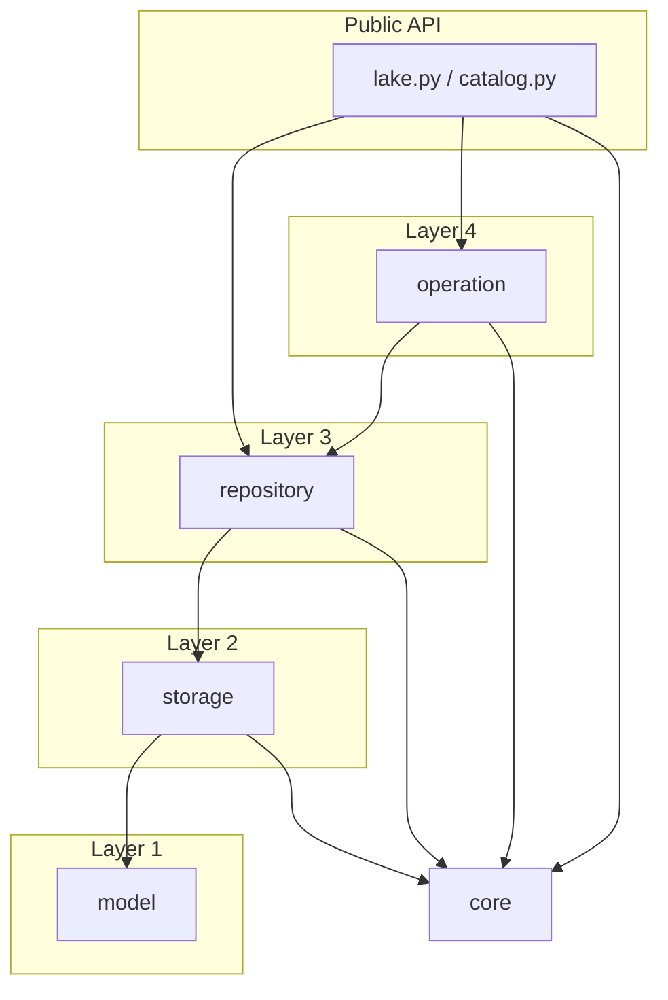
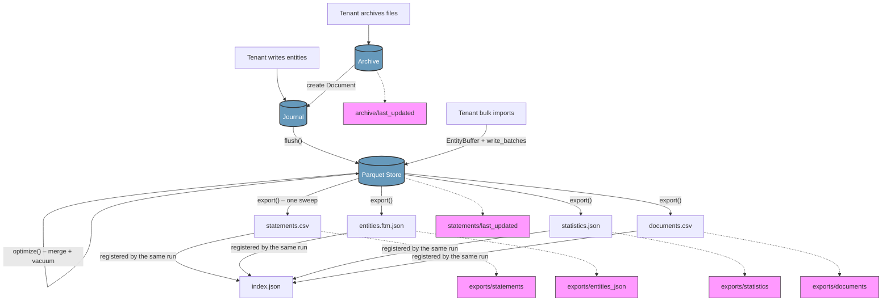

# Architecture

This document describes the layered architecture of `ftm-lakehouse`.

## Overview

The codebase follows a strict layered architecture with clear separation of concerns – see [Module Layout](#module-layout) for the full tree.

## Dependency Rules

Layers can only depend on layers below them:


```mermaid
flowchart TD
    subgraph Public["Public API"]
        API["lake.py / catalog.py"]
    end

    subgraph Layer4["Layer 4"]
        OP[operation]
    end

    subgraph Layer3["Layer 3"]
        REPO[repository]
    end

    subgraph Layer2["Layer 2"]
        STORE[storage]
    end

    subgraph Layer1["Layer 1"]
        MODEL[model]
    end

    CORE[core]

    API --> REPO
    API --> OP
    API --> CORE
    OP --> REPO
    OP --> CORE
    REPO --> STORE
    REPO --> CORE
    STORE --> MODEL
    STORE --> CORE
```

## Layer 1: Model

Pure data structures with no dependencies. Pydantic models and lightweight typed primitives.

```
model/
  file.py        # File, Files - archived file metadata
  job.py         # JobModel, DatasetJobModel - job execution tracking
  dataset.py     # DatasetModel - dataset metadata / config
  statement.py   # JOURNAL_SCHEMA / SHARDED_SCHEMA (pyarrow) +
                 # TABLE (SQLAlchemy) +
                 # LakehouseStatement (LakeStatement + deleted_at)
                 # + statements_to_arrow – schema for the parquet
                 # statement store and shared currency between buffer
                 # and writer.
```

**Principles:**

- No behavior beyond validation
- No storage awareness
- No external dependencies (except pydantic, pyarrow, sqlalchemy, anystore.model)

See [Model Reference](reference/model.md) for API details.

## Layer 2: Storage

Single-purpose storage interfaces. Each store does ONE thing.

```
storage/
  parquet.py         # ParquetStore - Delta Lake statement store
                     #   .append (sorted per-shard write)
                     #   .merge (per-partition dedup + tombstone reap)
                     #   .vacuum (delete obsolete files)
  journal/
    base.py          # BaseJournalStore
                     # .flush_batches()  – rotates the journal, yields
                     #                     Arrow batches, drops each segment
                     #                     once the consumer wrote it
    sql.py           # SqlJournalStore (sqlite / psql)
    api.py           # ApiJournalStore (HTTP forwarding)
  tags.py            # TagStore – key-value freshness tracking
  versions.py        # VersionStore – timestamped snapshots
```

Blob, file metadata, and text storage are handled directly by repositories using `anystore.Store` instances via `get_store()`, eliminating a layer of indirection.

### Sharded append-only pattern

The parquet statement store is partitioned by `(shard, bucket, origin)`:

- `shard` – `hash(entity_id) % shards` (the dataset's configured shard count), hex-padded. Derived in `ParquetStore.append` and nowhere else; producers hand over rows without it
- `bucket` – coarse FtM schema group (thing / interval / document / page / pages / mention)
- `origin` – caller-supplied source tag

Each row carries `first_seen`, `last_seen`, `fragment`, `role`, and `deleted_at` directly in the parquet schema (no separate translog). Reads reconcile: a read over a partition holding files `merge` did not write runs the dedupe query, while a partition made of merge output alone – canonical by construction – is a plain `WHERE deleted_at IS NULL` scan whose filters (`schema` / `prop` / `entity_id`) push straight through to DuckDB's per-file statistics; `entity_id` sits in the dedupe windows' keys, so an id lookup pushes below them too.

Writes are **append-only**: `append` derives each row's `shard` from its `entity_id`, then writes one parquet file per `(shard, bucket, origin)` partition the batch spans. It deliberately does not sort – nothing reads in physical order, and `merge` rewrites every partition an append touched anyway. Duplicates and tombstones land as additional rows.

Deriving the partition key at the last moment is what keeps the layout honest. Rows reach `append` in `JOURNAL_SCHEMA`, which has no `shard` column at all: a journalled row routinely outlives the process that wrote it, so a shard key packed at write time could encode a count that is no longer configured. Because the key is a function of `entity_id` and the *writing store's* count, a producer that resolved a stale config can no longer mis-route a partition – at worst it hands over a batch spanning several shards, which costs extra files that the next `merge` rewrites into one per partition.

**Reads are correct on any store; `merge` is compaction.** Dedupe, fragment supersession, `first_seen`/`last_seen` folding and tombstone hiding happen in one DuckDB query, `_dedupe_sql`, which a read runs over a dirty partition and `merge` runs to rewrite it – so the rows a read returns are the same before and after a merge, and what a merge changes is the cost (a clean partition is a plain scan) and the disk (tombstones past grace and the rows they shadow are gone). The query routes every row into one of two isolated branches on the `fragment` column (empty-string sentinel, never NULL):

- **non-fragment** (`fragment = ''`, the default): content-addressed dedup – latest `last_seen` per statement `id` wins; distinct ids never interact. Scoped per `(shard, bucket, origin)` partition, so the *same* statement observed under two origins is kept once per origin (merge cannot cross origin partitions).
- **fragment-bearing** (`fragment != ''`): supersession per `(origin, entity_id, prop, fragment, role)` group – every row tied at the group's max `last_seen` survives (the latest emission, multi-valued props included), older emissions go. See [Fragment Supersession](usage/entities.md#fragment-supersession) for semantics and the producer contract.

`role` – who asserted the statement, as opposed to `origin`'s where – sits in the window key of both branches, making it the fourth row-identity dimension after `id` / `origin` / `fragment`: two roles asserting identical content survive as two rows (full provenance) while one role re-asserting collapses. It is nullable, and DuckDB groups NULLs together in a `PARTITION BY`, so role-less rows dedupe against each other. `first_seen` folds per `(id, role)` rather than per `id`, so a role's first assertion of content an older role already wrote keeps its own date and stays visible to `first_seen`-based diffs. See [The Role Field](usage/entities.md#the-role-field).

The async `optimize` operation runs the two storage primitives in order. `merge` holds the merge lock (`.LOCK-MERGE`), which the export sweep holds too – so an optimize never vacuums files a running sweep still reads – but which appends do not wait for: a merge removes exactly the files it read and an append only adds, Delta commits both, and a read reconciles the result, so ingest flows through an hours-long merge. The in-place rewrites (re-shard, `delete_origin`, schema changes, `vacuum`) take the exclusive `.LOCK` as well, and appends back off while it is held. Delta's optimistic concurrency serializes concurrent append commits:

| Step | Cost | What it does |
|------|------|--------------|
| `merge()` | expensive | Per-partition rewrite: keep latest row per `(id, role)` (`ROW_NUMBER`) / latest emission per fragment group, fold `first_seen` to min, drop tombstones past grace |
| `vacuum()` | cheap | Delta `VACUUM` – delete files no longer referenced in the Delta log |

`merge` reads the Delta log once per run: it loads one snapshot, hands each dirty partition's files from it to DuckDB (`read_parquet` over exactly those files, no `delta_scan`), writes the merged files with DuckDB's `COPY`, and commits the results in batches of 64 partitions – one transaction of `add` and `remove` actions each. Replaying the log per partition is what made merges slow on large stores: every `delta_scan` and every `write_deltalake` replays the latest checkpoint, which lists every live file of the table. The dedupe query is the one reads use over a dirty partition, so a merge and a read can never disagree about what the rows mean. A run that committed anything ends with a Delta checkpoint: Delta writes one only every hundredth commit, and until then every load replays the previous one – which still lists every file the merge removed. Partitions can merge in parallel processes (`LAKEHOUSE_WORKERS`) – they are independent, a worker writes files and commits nothing, and it replays no log either, since the parent hands it the partition's files. Memory is DuckDB's to bound: the windows and the sort spill past each worker's share of `LAKEHOUSE_DUCKDB_MEMORY_LIMIT`; a partition too large to merge in acceptable time wants more shards.

The store's Delta table is created with `delta.deletedFileRetentionDuration = 1 hour` and `delta.logRetentionDuration = 1 day` (the `migrate_parquet_table_properties` migration applies them to older stores). The Delta defaults – a week of `remove` actions in every checkpoint, 30 days of superseded checkpoints on disk – let the log of a frequently merged store outgrow the data it describes.

#### Sharding – why, and how many shards

The `shard` partition key is the unit that keeps per-partition working sets bounded, independent of total dataset size. Everything expensive in the lakehouse operates one `(shard, bucket)` partition at a time:

- **Writes:** producers hand over whole batches without a partition key and `append` derives each row's shard, writing one file per `(shard, bucket, origin)` partition the batch spans. Bigger batches therefore cost fewer files, not more.
- **Reads:** statement queries iterate `(shard, bucket)` partitions in Python, each over that pair's files; the live view is a plain scan, so filters push to file statistics and a full-store `ORDER BY entity_id` stays bounded to one partition. Single-entity lookups hash the entity id and scan just its own shard, in one query. The files come from a Delta snapshot each process keeps and advances incrementally (appends write through the same one), so a read never replays the log – `delta_scan` replayed it per query. Global aggregates (`count`, statistics, sorted or sliced queries) still use `delta_scan`.
- **Optimize:** the merge rewrite materializes one partition at a time (per worker) – its memory and rewrite cost scale with the largest partition, not the whole table.

Sharding is a trade-off, not a free win: every shard multiplies the partition count (`shard × bucket × origin`), which means more small parquet files, more Delta log metadata, and more per-partition query iterations. For small and medium datasets that overhead costs more than the bounded working sets gain.

That's why the **default is `0`** – a single shard (`shard <= 1` collapses to one `"0"` partition). The default is hardcoded, deliberately not an environment setting: the shard count is per-dataset configuration, recorded in the dataset's `config.yml` at creation (e.g. `ensure_dataset("big_leak", shards=8)`), and every reader and writer resolves it from there. Placement is enforced rather than trusted: `ParquetStore.append` derives each row's shard from its `entity_id` against the count *it* resolved, so a producer holding a stale config cannot mis-shard an existing dataset. Don't configure shards unless the dataset is huge: from roughly tens of millions of statements upward, set `shards: 8` (or more, scaling with entity count) so merge rewrites stay bounded. Size it for the data you expect, not the data you have on day one: the shard count is fixed for as long as the store stands, and changing it means rewriting every partition. When a dataset does outgrow its layout, `ftm-lakehouse -d <dataset> maintenance shard --shards 8` (the `ShardOperation`) is that rewrite – see [Re-sharding](#re-sharding-an-existing-dataset).

#### Re-sharding an existing dataset

`ShardOperation` (`ftm-lakehouse -d <dataset> maintenance shard --shards <n>`, or `operation.shard(dataset, shards)`) changes the count after the fact. It drains the journal, then rewrites the statement store onto the new layout and records the new count in `config.yml` – in that order, since the config is what every other process resolves the layout from.

`bucket` and `origin` are invariant under a re-shard – only `shard` moves – so the rewrite runs one `write_deltalake` per `(bucket, origin)` group: every source partition of the group streams through a single chained Arrow reader (`SELECT *` with the `shard` column recomputed from `entity_id` in DuckDB), and the group's partitions are replaced wholesale in one atomic commit. Nothing is materialized in Python. Like `merge`, the re-shard reads the Delta log once: source partitions are read from one snapshot's file lists (`read_parquet`, no `delta_scan` per partition) and every group write goes through that same table handle.

Deliberately **not** a merge: rows are neither deduped nor sorted on the way through, because the trigger is a store whose partitions have grown too big to query well, not one whose content is wrong. Every rewritten partition therefore comes out dirty (delta-rs names its files `part-*`), so reads reconcile it; run `optimize` afterwards to get plain-scan reads and the file sort order back. Re-running a re-shard is safe: each row's target shard is a function of its `entity_id` and the target count alone, so a run interrupted between group commits is repaired by running it again.

Two caveats. The write fence holds off parquet appends but not journal writes, so statements journalled under the old count and flushed after the rewrite land in the wrong partition – **run it with writers stopped**. And the operation skips when `config.yml` already names the target count, so a config edited by hand to a count the store was never rewritten for needs `--force`.

**Principles:**

- Each store is independent – no cross-store awareness
- Operates on a single storage URI
- Returns/accepts model objects
- No business logic

See [Storage Reference](reference/storage.md) for API details.

## Layer 3: Repository

Domain-specific combinations of multiple stores. Each repository owns ONE domain concept.

```
repository/
  base.py        # DatasetHandle - dataset-addressed handle base
  archive.py     # ArchiveRepository - blobs, file metadata, text (via get_store)
  entities.py    # EntityRepository - uses JournalStore + ParquetStore
  documents.py   # DocumentRepository - compiled document metadata CSV + diffs
  job.py         # JobRepository - job tracking (via get_store)
  factories.py   # Cached factory functions (get_archive, get_entities, etc.)
```

**Principles:**

- Combines stores for a single domain concept
- May use `get_store()` directly for simple storage needs (blobs, metadata JSON)
- No cross-domain awareness (ArchiveRepository doesn't know about statements)
- Provides domain-specific operations
- Uses TagStore for freshness tracking

See [Repository Reference](reference/repository.md) for API details.

## Layer 4: Operation

Multi-step workflows that coordinate across repositories. This is where "action chains" are made explicit.

```
operation/
  base.py          # DatasetJobOperation - base class with freshness checks
  export.py        # ExportOperation - every export from one entity sweep
  crawl.py         # CrawlOperation - source → files → entities
  maintenance.py   # OptimizeOperation - merge + vacuum in one pass
  make.py          # MakeOperation - flush + export
  download.py      # DownloadArchiveOperation
```

**Principles:**

- Operations are internal (not exposed to clients directly)
- Make multi-step processes explicit
- Handle freshness checks via `@skip_if_latest` decorator or `ensure_flush()`
- May span multiple repositories
- Create job run records for tracking

See [Operation Reference](reference/operation.md) for API details.

## Layer 5: Public API

The public interface that clients use – repositories are the dataset handle, resolved through the LRU-cached factories:

```
lake.py          # get_lakehouse(), repository shortcuts (re-exports)
catalog.py       # config.yml lifecycle functions + slim Catalog
```

**Day-to-day access** goes through the repository factories – every path addressing the same dataset shares one cached instance:

```python
from ftm_lakehouse import ensure_dataset, get_entities, get_archive

ensure_dataset("my_data", shards=8, compression="zst")   # config recorded at creation
entities = get_entities("my_data")                       # EntityRepository
archive = get_archive("my_data")                         # ArchiveRepository
```

**Config lifecycle** lives in module functions: `ensure_dataset()` (get-or-create), `update_dataset()` (merge-write + versioned snapshot; invalidates the factory caches so newly fetched repositories see the fresh config), `get_dataset_model()` (fresh read), `get_dataset_index()`, `dataset_exists()`. Repositories snapshot their model (`shards`, `compression`) at construction – layout-affecting config must be set at creation.

**Multi-dataset concerns** go through the slim `Catalog` (`get_lakehouse()`): `list_datasets()`, `dataset_uri(name)`. The API server keeps one as `app.state.lake`.

**Custom dataset models**: register a `DatasetModel` subclass process-wide via `set_model_class()` – every config read constructs through it.

See [Lake Reference](reference/lake.md) for API details.

## Core

Cross-cutting concerns used by all layers.

```
core/
  settings.py           # Configuration from environment (Settings, ApiSettings)
  config.py             # Config loading utilities (load_config)
  conventions/
    path.py             # Path patterns (archive/, exports/, etc.)
    tag.py              # Tag keys (statements/last_updated, exports/statements, etc.)
```

**Principles:**

- No business logic
- Pure utilities and configuration
- Can be used by any layer

**Additional Modules:**
```
helpers/                # Domain-specific utilities
  file.py               # File handling (mime_to_schema, etc.)
  statements.py         # Statement pack/unpack for journal
  serialization.py      # Model serialization utilities
```

## Usage Examples

For detailed usage examples, see:

- [Quickstart](quickstart.md) - Getting started guide
- [Working with Entities](usage/entities.md) - Entity/statement operations
- [Working with Files](usage/archive.md) - File archive operations

## Module Layout

```
ftm_lakehouse/
├── lake.py                  # get_lakehouse(), repository shortcuts
├── catalog.py               # config lifecycle fns + slim Catalog
├── util.py                  # dependency-light primitives (validation, checksums)
├── exceptions.py
│
├── model/                   # Layer 1: Pure data structures
│   ├── dataset.py           # DatasetModel + set_model_class hook
│   ├── file.py              # File metadata model
│   ├── job.py               # Job models
│   └── statement.py         # JOURNAL/SHARDED_SCHEMA, LakehouseStatement
│
├── storage/                 # Layer 2: Single-purpose storage interfaces
│   ├── journal/             # SQL write-ahead log (sql.py, api.py, base.py)
│   ├── parquet.py           # ParquetStore (Delta Lake, write fence, merge)
│   ├── tags.py              # TagStore (freshness)
│   └── versions.py          # VersionStore (config / index snapshots)
│
├── repository/              # Layer 3: Domain-specific storage combinations
│   ├── base.py              # DatasetHandle, dataset_uri(), ensure_zfs()
│   ├── factories.py         # LRU-cached single instantiation path
│   ├── entities/            # EntityRepository (main.py) + API delegate (api.py)
│   ├── archive.py           # ArchiveRepository (content-addressed files)
│   ├── documents.py         # DocumentRepository
│   ├── artifacts.py         # Export artifacts, their writers and diff series
│   └── job.py               # JobRepository
│
├── operation/               # Layer 4: Multi-step workflow operations
│   ├── base.py              # DatasetJobOperation (freshness targets / deps)
│   ├── factories.py         # export(), optimize(), make(), crawl(), ...
│   ├── export.py            # ExportOperation (one sweep, every artifact)
│   ├── maintenance.py       # OptimizeOperation
│   ├── make.py              # MakeOperation (full workflow)
│   ├── crawl.py             # CrawlOperation
│   └── download.py          # DownloadArchiveOperation
│
├── logic/                   # Pure business logic (no storage deps)
│   ├── entities/            # aggregate.py, buffer.py, explode.py
│   ├── parquet.py           # DuckDB view / merge SQL builders
│
├── helpers/                 # FtM-domain building blocks
│   ├── statements.py        # Statement wire format, BASE_ID stub
│   ├── file.py              # File → entity construction
│   └── serialization.py
│
├── api/                     # FastAPI REST API
│   ├── main.py              # App factory, blob mounting
│   ├── dependencies.py      # DatasetName / Entities / Shards / Journal deps
│   └── routes/              # entities.py, journal.py, operations.py
│
├── cli/                     # Typer CLI (sub-typer groups)
│   ├── __init__.py          # Main app, contexts, ls / datasets / configure
│   ├── io.py                # Shared bulk-import loop
│   ├── entities.py          # entities iterate / stream / import
│   ├── statements.py        # statements iterate / stream / import / sql
│   ├── archive.py           # archive get / ls / download
│   ├── maintenance.py       # make, export, maintenance flush / optimize / unlock
│   ├── crawl.py             # crawl (top level)
│   └── zfs.py               # zfs init (agent lives in the zfs-agent package)
│
└── core/                    # Cross-cutting concerns
    ├── settings.py          # LAKEHOUSE_* env configuration
    ├── config.py            # config.yml loading
    ├── api.py               # API-mode delegation mixin
    ├── conventions/         # path.py, tag.py
    └── zfs.py               # ZFS tuning + zfs-agent package caller
```

## Storage Layout & Tags

The on-disk layout of a dataset and the freshness-tag vocabulary are documented in [Conventions](conventions.md).

## Dependency Chain


```mermaid
flowchart TD
    A[Tenant writes entities] --> B[(Journal)]
    A2[Tenant archives files] --> AR[(Archive)]
    AR -.-> T0[archive/last_updated]
    AR --> |"create Document"| B

    B --> |"flush()"| C[(Parquet Store)]
    A3[Tenant bulk imports] --> |"EntityBuffer + write_batches"| C

    C --> |"optimize() – merge + vacuum"| C

    C --> |"export() – one sweep"| D[statements.csv]
    C --> |"export()"| E[entities.ftm.json]
    C --> |"export()"| F[statistics.json]
    C --> |"export()"| H[documents.csv]
    D & E & F & H --> |"registered by the same run"| G[index.json]

    C -.-> T2[statements/last_updated]
    D -.-> T3[exports/statements]
    E -.-> T4[exports/entities_json]
    F -.-> T5[exports/statistics]
    H -.-> T6[exports/documents]

    classDef tag fill:#f9f,stroke:#333,stroke-width:1px
    classDef storage fill:#69b,stroke:#333,stroke-width:2px,color:#fff
    class T0,T2,T3,T4,T5,T6 tag
    class B,C,AR storage
```

## Key Principles

1. **Each storage does ONE thing** - no cross-storage awareness
2. **Repositories combine storages** - for ONE domain concept
3. **Operations are explicit workflows** - no hidden side effects
4. **Freshness is explicit** - checked in operations, not decorators
5. **Public API is simple** - delegates to repositories/operations
6. **`__init__.py` exports only** - no logic in init files
7. **Strict layer dependencies** - upper layers depend on lower layers only
