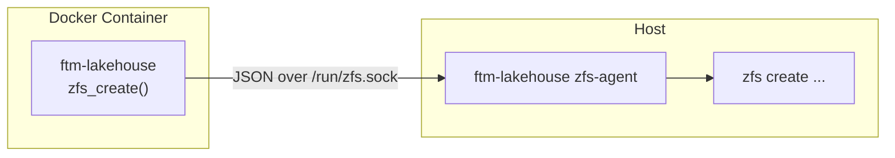

# ZFS Integration

When running on a ZFS pool, `ftm-lakehouse` can automatically create ZFS datasets with tuned properties for archive and statement storage. For containerized deployments where ZFS tools aren't available inside the container, a socket-based agent proxies ZFS commands to the host.

## Local Mode

If the lakehouse runs directly on a ZFS-backed filesystem, enable ZFS dataset creation:

```bash
export LAKEHOUSE_URI=/zpools/tank/lakehouse
export LAKEHOUSE_ON_ZFS=1
export LAKEHOUSE_ZFS_POOL=zpools/tank/lakehouse
```

`LAKEHOUSE_ZFS_POOL` is the ZFS dataset path (without leading slash) under which per-dataset children are created. It must match your actual ZFS pool layout.

When a new dataset is created, `ftm-lakehouse` calls `zfs create` to set up child datasets with optimized properties:

| ZFS Dataset | recordsize | compression | sync | Purpose |
|-------------|-----------|-------------|------|---------|
| `{dataset}/` | (parent defaults) | (parent defaults) | (parent defaults) | Parent dataset with `atime=off`, `xattr=sa`, `dnodesize=auto` |
| `{dataset}/archive` | 128K | zstd | disabled | Content-addressed file storage |
| `{dataset}/entities/statements` | 1M | lz4 | standard | Delta Lake parquet (already snappy-compressed) |

## Mountpoint Ownership

By default ZFS creates mountpoints owned by `root:root`. If the lakehouse process runs as a non-root user (e.g. inside a container), set `LAKEHOUSE_ZFS_OWNER` to chown new mountpoints after creation:

```bash
export LAKEHOUSE_ZFS_OWNER=1000:1000
```

When unset (the default), no `chown` is performed and mountpoints keep the default root ownership. This is fine when the process runs as root or when the pool mountpoints are already owned correctly.

The owner value is passed through the socket protocol, so the host-side agent executes the `chown` with its (root) privileges on behalf of the container.

## Socket Agent Mode

In Docker or Swarm deployments the container typically doesn't have ZFS tools installed. Instead of adding ZFS to every container image, a host-side agent listens on a Unix socket and executes `zfs create` on behalf of the container.

### Architecture



### Starting the Agent

On the host:

```bash
ftm-lakehouse zfs-agent --socket /run/zfs.sock --pool zpools/tank/lakehouse
```

| Option | Description |
|--------|-------------|
| `--socket, -s` | Unix socket path to listen on (or set `LAKEHOUSE_ZFS_SOCKET`) |
| `--pool, -p` | ZFS pool path (or set `LAKEHOUSE_ZFS_POOL`). Required -- the agent only creates datasets under this path. |

### Configuring the Container

Mount the socket into the container and set the environment:

```yaml
services:
  api:
    image: ftm-lakehouse
    environment:
      LAKEHOUSE_URI: /zpools/tank/lakehouse
      LAKEHOUSE_ON_ZFS: "1"
      LAKEHOUSE_ZFS_POOL: zpools/tank/lakehouse
      LAKEHOUSE_ZFS_SOCKET: /run/zfs.sock
    volumes:
      - /run/zfs.sock:/run/zfs.sock
      - /zpools/tank/lakehouse:/zpools/tank/lakehouse
```

When `LAKEHOUSE_ZFS_SOCKET` is set and `LAKEHOUSE_ON_ZFS` is enabled, `zfs_create()` sends requests over the socket instead of calling `zfs` via subprocess.

## Manual Initialization

To manually create ZFS datasets for a dataset without starting the full application:

```bash
ftm-lakehouse zfs-init my_dataset --pool zpools/tank/lakehouse
```

This creates the parent, archive, and statements ZFS datasets with tuned properties. The pool can also be set via `LAKEHOUSE_ZFS_POOL`.

## Protocol

The socket agent uses a JSON-lines protocol over Unix domain sockets. Each request and response is a single JSON object terminated by a newline.

**Request:**

```json
{"action": "create", "dataset": "tank/lakehouse/my_dataset/archive", "props": {"recordsize": "128K", "compression": "zstd"}}
```

**Response (success):**

```json
{"ok": true}
```

**Response (error):**

```json
{"ok": false, "error": "zfs create failed: permission denied"}
```

`exist_ok` is implicit -- creating an already-existing dataset returns `{"ok": true}`.

## Security

The agent validates every request before execution:

- **Leaf dataset validation** -- the final path component (the FTM dataset name) is checked using `followthemoney.dataset.util.dataset_name_check` (lowercase alphanumeric and underscores only). Parent path components allow standard ZFS naming (alphanumeric, hyphens, dots, underscores).
- **Path traversal prevention** -- `..` sequences are rejected
- **Pool restriction** -- the agent rejects any dataset path that doesn't start with the configured pool path

## Environment Variables

| Variable | Description | Default |
|----------|-------------|---------|
| `LAKEHOUSE_ON_ZFS` | Enable ZFS dataset creation | `false` |
| `LAKEHOUSE_ZFS_POOL` | ZFS dataset path for the lakehouse root (e.g. `zpools/tank/lakehouse`) | (required when `ON_ZFS` is enabled) |
| `LAKEHOUSE_ZFS_SOCKET` | Path to the Unix socket for remote ZFS operations | (unset -- use local subprocess) |
| `LAKEHOUSE_ZFS_OWNER` | `uid:gid` to chown new dataset mountpoints to (e.g. `1000:1000`) | (unset -- no chown, root owns mountpoints) |
