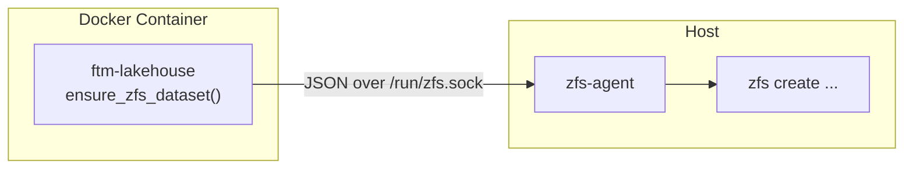

# ZFS Integration

When running on a ZFS pool, `ftm-lakehouse` can automatically create ZFS datasets with tuned properties for archive and statement storage. The transport – local `zfs` subprocess vs. a host-side socket agent for containerized deployments – is the external [zfs-agent](https://github.com/dataresearchcenter/zfs-agent) package; `ftm-lakehouse` contributes only the per-storage-type tuning and calls it when datasets are first touched.

## Local Mode

If the lakehouse runs directly on a ZFS-backed filesystem, enable ZFS dataset creation:

```bash
export LAKEHOUSE_URI=/zpools/tank/lakehouse
export LAKEHOUSE_ON_ZFS=1
export LAKEHOUSE_ZFS_POOL=zpools/tank/lakehouse
```

`LAKEHOUSE_ZFS_POOL` is the ZFS dataset path (without leading slash) under which per-dataset children are created. It must match your actual ZFS pool layout.

When a new dataset is created, `ftm-lakehouse` calls `zfs create` (via `zfs-agent`) to set up child datasets with optimized properties:

| ZFS Dataset | recordsize | compression | sync | Purpose |
|-------------|-----------|-------------|------|---------|
| `{dataset}/` | (parent defaults) | (parent defaults) | standard | Parent dataset with `atime=off`, `xattr=sa`, `dnodesize=auto` |
| `{dataset}/archive` | 128K | `zstd-9` | standard | Content-addressed file storage (mixed-entropy blobs) |
| `{dataset}/statements` | 1M | `off` | standard | Delta Lake parquet – parquet handles compression internally (SNAPPY), ZFS-level compression on top burns CPU per block with no benefit |

## Mountpoint Ownership

By default ZFS creates mountpoints owned by `root:root`. Set the `zfs-agent` package's `ZFS_OWNER` to chown new mountpoints after creation:

```bash
export ZFS_OWNER=1000:1000
```

When unset (the default), no `chown` is performed and mountpoints keep root ownership.

- **Local mode**: `ZFS_OWNER` is read on every create. Set it wherever `ftm-lakehouse` or `ftm-lakehouse zfs init` runs.
- **Socket mode**: Ownership is controlled by the agent (host-side), not the client. Pass `--owner` to the `zfs-agent` command or set `ZFS_OWNER` where the agent runs. The client does not send ownership information.

## Socket Agent Mode

In Docker or Swarm deployments the container typically doesn't have ZFS tools installed. Instead of adding ZFS to every container image, the host runs the standalone agent from the `zfs-agent` package, which listens on a Unix socket and executes `zfs create` on behalf of the container.


```mermaid
flowchart LR
    subgraph container["Docker Container"]
        app["ftm-lakehouse<br/>ensure_zfs_dataset()"]
    end

    subgraph host["Host"]
        agent["zfs-agent"]
        zfs["zfs create ..."]
        agent --> zfs
    end

    app -- "JSON over /run/zfs.sock" --> agent
```

On the host (requires `pip install zfs-agent`):

```bash
zfs-agent --socket /run/zfs.sock --pool zpools/tank/lakehouse --owner 1000:1000 --allowed-uid 1000
```

The agent enforces a `SO_PEERCRED` UID check, `0600` socket permissions, prop allowlisting and pool restriction – see the [zfs-agent documentation](https://github.com/dataresearchcenter/zfs-agent) for the protocol, security gates and its `ZFS_*` environment variables.

Mount the socket into the container and set the environment:

```yaml
services:
  api:
    image: ftm-lakehouse
    user: "1000:1000"
    environment:
      LAKEHOUSE_URI: /zpools/tank/lakehouse
      LAKEHOUSE_ON_ZFS: "1"
      LAKEHOUSE_ZFS_POOL: zpools/tank/lakehouse
      ZFS_SOCKET: /run/zfs.sock
    volumes:
      - /run/zfs.sock:/run/zfs.sock
      - /zpools/tank/lakehouse:/zpools/tank/lakehouse
```

The container's `user:` UID must match the agent's `--allowed-uid` – peer credentials cross the bind-mounted socket unchanged, so the host-side agent sees the container process's UID directly. When `ZFS_SOCKET` is set, creates go over the socket instead of a local `zfs` subprocess.

## Manual Initialization

To manually create ZFS datasets for a dataset without starting the full application:

```bash
ftm-lakehouse zfs init my_dataset --pool zpools/tank/lakehouse
```

This creates the parent, archive, and statements ZFS datasets with tuned properties. The pool can also be set via `LAKEHOUSE_ZFS_POOL`.

## Environment Variables

Lakehouse-side: `LAKEHOUSE_ON_ZFS` and `LAKEHOUSE_ZFS_POOL` – see the [configuration reference](configuration.md). Transport-side (`ZFS_SOCKET`, `ZFS_OWNER`, `ZFS_POOL`, `ZFS_ALLOWED_UID`, `ZFS_EXTRA_PROPS`): the [zfs-agent](https://github.com/dataresearchcenter/zfs-agent) package.
