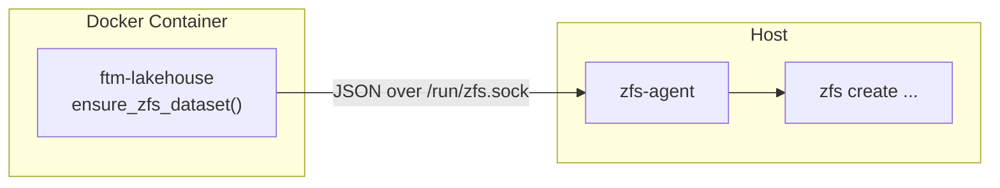

# ZFS Integration

When running on a ZFS pool, `ftm-lakehouse` can automatically create ZFS datasets with tuned properties for archive and statement storage. The transport – local `zfs` subprocess vs. a host-side socket agent for containerized deployments – is the external [zfs-agent](https://github.com/dataresearchcenter/zfs-agent) package; `ftm-lakehouse` contributes only the per-storage-type tuning and calls it when datasets are first touched.

## Local Mode

If the lakehouse runs directly on a ZFS-backed filesystem, enable ZFS dataset creation:

```bash
export LAKEHOUSE_URI=/zpools/tank/lakehouse
export LAKEHOUSE_ON_ZFS=1
export LAKEHOUSE_ZFS_POOL=zpools/tank/lakehouse
```

`LAKEHOUSE_ZFS_POOL` is the ZFS dataset path (without leading slash) under which per-dataset children are created. It must match your actual ZFS pool layout.

When a new dataset is created, `ftm-lakehouse` calls `zfs create` (via `zfs-agent`) to set up child datasets with optimized properties:

| ZFS Dataset | recordsize | compression | sync | Purpose |
|-------------|-----------|-------------|------|---------|
| `{dataset}/` | (parent defaults) | (parent defaults) | standard | Parent dataset with `atime=off`, `xattr=sa`, `dnodesize=auto` |
| `{dataset}/archive` | 128K | `zstd-9` | standard | Content-addressed file storage (mixed-entropy blobs) |
| `{dataset}/statements` | 1M | `off` | standard | Delta Lake parquet – parquet handles compression internally (SNAPPY), ZFS-level compression on top burns CPU per block with no benefit |

## Mountpoint Ownership

By default ZFS creates mountpoints owned by `root:root`. Set the `zfs-agent` package's `ZFS_OWNER` to chown new mountpoints after creation:

```bash
export ZFS_OWNER=1000:1000
```

When unset (the default), no `chown` is performed and mountpoints keep root ownership.

- **Local mode**: `ZFS_OWNER` is read on every create. Set it wherever `ftm-lakehouse` or `ftm-lakehouse zfs init` runs.
- **Socket mode**: Ownership is controlled by the agent (host-side), not the client. Pass `--owner` to the `zfs-agent` command or set `ZFS_OWNER` where the agent runs. The client does not send ownership information.

## Socket Agent Mode

In Docker or Swarm deployments the container typically doesn't have ZFS tools installed. Instead of adding ZFS to every container image, the host runs the standalone agent from the `zfs-agent` package, which listens on a Unix socket and executes `zfs create` on behalf of the container.


```mermaid
flowchart LR
    subgraph container["Docker Container"]
        app["ftm-lakehouse<br/>ensure_zfs_dataset()"]
    end

    subgraph host["Host"]
        agent["zfs-agent"]
        zfs["zfs create ..."]
        agent --> zfs
    end

    app -- "JSON over /run/zfs.sock" --> agent
```

On the host (requires `pip install zfs-agent`):

```bash
zfs-agent --socket /run/zfs.sock --pool zpools/tank/lakehouse --owner 1000:1000 --allowed-uid 1000
```

The agent enforces a `SO_PEERCRED` UID check, `0600` socket permissions, prop allowlisting and pool restriction – see the [zfs-agent documentation](https://github.com/dataresearchcenter/zfs-agent) for the protocol, security gates and its `ZFS_*` environment variables.

Mount the socket into the container and set the environment:

```yaml
services:
  api:
    image: ftm-lakehouse
    user: "1000:1000"
    environment:
      LAKEHOUSE_URI: /zpools/tank/lakehouse
      LAKEHOUSE_ON_ZFS: "1"
      LAKEHOUSE_ZFS_POOL: zpools/tank/lakehouse
      ZFS_SOCKET: /run/zfs.sock
    volumes:
      - /run/zfs.sock:/run/zfs.sock
      - /zpools/tank/lakehouse:/zpools/tank/lakehouse
```

The container's `user:` UID must match the agent's `--allowed-uid` – peer credentials cross the bind-mounted socket unchanged, so the host-side agent sees the container process's UID directly. When `ZFS_SOCKET` is set, creates go over the socket instead of a local `zfs` subprocess.

## Manual Initialization

To manually create ZFS datasets for a dataset without starting the full application:

```bash
ftm-lakehouse -d my_dataset zfs init --pool zpools/tank/lakehouse
```

This creates the parent, archive, and statements ZFS datasets with tuned properties. The pool can also be set via `LAKEHOUSE_ZFS_POOL`.

## Replication

A dataset can be replicated between two lakehouse hosts – the ad-hoc counterpart to a scheduled tool like zrepl, replacing a hand-built `zfs send | mbuffer` / `mbuffer | zfs receive` pair. One host serves `/{dataset}/_api/zfs/...`; the other pushes to or pulls from it:

```bash
# on the host that has the data
ftm-lakehouse -d my_dataset zfs push https://lake-b.example.org
# or, from the host that should get it
ftm-lakehouse -d my_dataset zfs pull https://lake-a.example.org
# snapshots (with guids) and resume tokens on both sides
ftm-lakehouse -d my_dataset zfs status https://lake-b.example.org
```

What happens:

- Every part the run covers – the dataset, its `archive` and its `statements` child, in that order – is checked against the receiving side first (see below). A refused run takes no snapshot and sends nothing, and never leaves some parts at the new snapshot and others not.
- The dataset's journal is flushed into the statement store, then a new snapshot `@YYYYmmddHHMMSS` (UTC) is taken on the sending side of the parts being sent, in one atomic `zfs snapshot` – by `push` locally, by `pull` through the api. `--snapshot NAME` sends an existing one instead (no flush). `push` flushes through the local catalog, so run it with the lakehouse's own `LAKEHOUSE_URI` / `LAKEHOUSE_JOURNAL_URI`; statements journaled after the flush aren't in the snapshot.
- Each part goes as its own `zfs send -c -L -e -w` stream (raw: an encrypted dataset stays encrypted on the wire). `--no-archive` / `--no-statements` leave a child out. Separate streams rather than `zfs send -R` so that leaving a child out is safe: a replication stream received with `-F` destroys the datasets it doesn't carry.
- The incremental base is the newest snapshot both sides share, matched by **guid**, not by name – any common snapshot works, including one zrepl or sanoid replicated. With no dataset on the receiving side the send is full.
- The receiving side runs `zfs receive -s -F` with the part's tuning (`-o`, as in the table above – streams carry no properties). `-F` rolls the target back to the base, discarding changes made since, which is what lets a receive land on a replica that was merely mounted. It would also destroy target snapshots *newer* than the base, so that is refused unless `--force`. A target that exists without any snapshot – e.g. created empty by the lakehouse on the other side – would be replaced by a full receive: refused unless `--replace`. The receiving side checks both itself, right before it reads the stream, whatever the sender planned with.
- An interrupted transfer leaves a resume token on the receiving side (`-s`). The next run resumes it first – unless the target got newer snapshots meanwhile, which needs `--force` as above – then sends whatever is still missing. A token that can't be resumed any more (its snapshot is gone on the sending side) fails the run with a hint: `--force` discards the partial state and starts over. The sending side only resumes a token made for the requested dataset.
- The stream is buffered in memory on both ends, which is what `mbuffer -m` did: `--buffer 2GiB` on the cli, `LAKEHOUSE_ZFS_BUFFER` on the server (default `512MiB` per transfer, at least `1MiB`).

Automatic snapshot names have one-second resolution: two runs taking a snapshot of the same dataset within the same second – two pulls from different hosts, say – collide, the second failing with "dataset already exists". Run it again, or pass `--snapshot`.

### Serving the replication api

Two modes, the same routes:

- **Mounted into the api** – set `LAKEHOUSE_ZFS_API=1` (and `LAKEHOUSE_ZFS_POOL`) on the lakehouse api. The routes sit under `/{dataset}/_api/`, so the nginx `location` in front of the api and its api-key gate cover them as they are. A key that may replicate needs a scope for `/{dataset}/_api/zfs` *and* everything below it – the status route has no trailing slash: `"~^repl-key:[^:]+:/[^/]+/_api/zfs(/|$)" 1;`. The replicating client sends `LAKEHOUSE_ZFS_PEER_KEY` / `LAKEHOUSE_ZFS_PEER_SECRET` – never `LAKEHOUSE_API_KEY`, so that credential doesn't reach whatever url a replication is pointed at. The api container has no ZFS, so the host's `zfs-agent` has to serve the replication actions too – the api hands it one end of a pipe over the socket, and the data never passes through the socket itself:

    ```bash
    zfs-agent --socket /run/zfs.sock --pool zpools/tank/lakehouse --owner 1000:1000 --allowed-uid 1000 \
        --actions create,status,snapshot,send,receive,abort
    ```

    Also make sure the reverse proxy doesn't buffer or time out long streams – the shipped nginx config already streams request and response bodies unbuffered (`proxy_request_buffering off`, `proxy_buffering off`, `client_max_body_size 0`).

- **Standalone** – for hosts whose api isn't exposed, serve only the replication routes:

    ```bash
    ftm-lakehouse zfs serve --host 10.0.0.5 --port 8881 --pool zpools/tank/lakehouse
    ```

    **There is no authentication**: anybody who reaches the port can read, and overwrite, every dataset in the pool. It binds to `127.0.0.1` by default – bind it only to an interface that trusted peers alone can reach, like the plain `mbuffer` port it replaces. Run it as root, or point it at an agent via `ZFS_SOCKET` as above – on Linux `zfs allow` doesn't cover mounting a received dataset, which needs root. It needs the lakehouse's `LAKEHOUSE_URI` / `LAKEHOUSE_JOURNAL_URI` too, to flush a dataset's journal before a pull's snapshot.

Things to keep in mind:

- The client needs ZFS access too: run it on the host as root, or in a container through the agent via `ZFS_SOCKET`.
- A snapshot taken on the receiving side *while* a receive runs is still destroyed by its `-F` – the check can only see the target as it was when the receive began.
- Received files keep the sending side's owner: run the receiving lakehouse as the same uid, or chown the mountpoints after the first receive.
- The api worker that received a dataset drops its cached repositories, so a new `config.yml` (e.g. another `shards` count) takes effect there; other api workers keep their cached layout until restarted – restart the api after replicating a dataset whose shard count changed.
- A snapshot taken while `maintenance optimize` runs may contain its `.LOCK` file; release it on the receiving side with `ftm-lakehouse maintenance unlock` before writing there.
- When zrepl or sanoid manage the same datasets, their keep rules decide which snapshots survive. The `@YYYYmmddHHMMSS` ones being pruned is harmless, as long as the two sides keep *some* snapshot in common. If none is left, the transfer is refused ("share no snapshot") and neither `--force` nor `--replace` gets past that: a full resend means destroying the target by hand first.
- The routes answer a failing `zfs` – or a refused receive – with `409` and the reason, an unreachable `zfs-agent` with `503`. A receive that fails once the stream is flowing (disk full, a corrupt stream) is only reported after the sender has finished uploading: the server reads the rest of the stream rather than leave the client stuck writing it. A send that fails after it has started streaming can only cut the stream short; the receiving `zfs receive` rejects it and keeps the partial state, so the next run resumes.

## Environment Variables

Lakehouse-side: `LAKEHOUSE_ON_ZFS`, `LAKEHOUSE_ZFS_POOL`, `LAKEHOUSE_ZFS_API`, `LAKEHOUSE_ZFS_BUFFER` and `LAKEHOUSE_ZFS_PEER_KEY` / `_SECRET` – see the [configuration reference](configuration.md). Transport-side (`ZFS_SOCKET`, `ZFS_OWNER`, `ZFS_POOL`, `ZFS_ALLOWED_UID`, `ZFS_EXTRA_PROPS`, `ZFS_ACTIONS`): the [zfs-agent](https://github.com/dataresearchcenter/zfs-agent) package.
