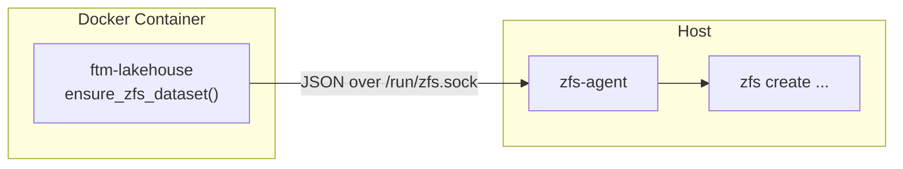

# ZFS Integration

On a ZFS pool, `ftm-lakehouse` can create a tuned ZFS dataset per storage type when a dataset is first touched. The transport – a local `zfs` subprocess, or a host-side socket agent for containers – is the external [zfs-agent](https://github.com/dataresearchcenter/zfs-agent) package; `ftm-lakehouse` contributes the tuning and the call.

## Local Mode

If the lakehouse runs directly on a ZFS-backed filesystem, enable ZFS dataset creation:

```bash
export LAKEHOUSE_URI=/zpools/tank/lakehouse
export LAKEHOUSE_ON_ZFS=1
export LAKEHOUSE_ZFS_POOL=zpools/tank/lakehouse
```

`LAKEHOUSE_ZFS_POOL` is the ZFS dataset path (no leading slash) the per-dataset children are created under; it must match the pool layout.

Each new dataset gets these ZFS datasets (`zfs create` via `zfs-agent`):

| ZFS Dataset | recordsize | compression | Purpose |
|-------------|-----------|-------------|---------|
| `{dataset}/` | (inherited) | (inherited) | Parent, with `atime=off`, `xattr=sa`, `dnodesize=auto` |
| `{dataset}/archive` | 1M | `zstd-9` | Content-addressed file storage |
| `{dataset}/statements` | 1M | `off` | Delta Lake parquet – already zstd-compressed |

Both children also set `sync=standard` and `logbias=throughput`.

## Mountpoint Ownership

ZFS creates mountpoints owned by `root:root`. Set the `zfs-agent` package's `ZFS_OWNER` to chown new mountpoints; unset, no `chown` happens:

```bash
export ZFS_OWNER=1000:1000
```

- **Local mode**: set `ZFS_OWNER` wherever `ftm-lakehouse` or `ftm-lakehouse zfs init` runs.
- **Socket mode**: ownership is the agent's – pass `--owner` to `zfs-agent` or set `ZFS_OWNER` where it runs. The client sends none.

## Socket Agent Mode

Containers typically lack the ZFS tools. Instead, the host runs the `zfs-agent` daemon, which listens on a Unix socket and runs `zfs create` for the container.


```mermaid
flowchart LR
    subgraph container["Docker Container"]
        app["ftm-lakehouse<br/>ensure_zfs_dataset()"]
    end

    subgraph host["Host"]
        agent["zfs-agent"]
        zfs["zfs create ..."]
        agent --> zfs
    end

    app -- "JSON over /run/zfs.sock" --> agent
```

On the host (requires `pip install zfs-agent`):

```bash
zfs-agent --socket /run/zfs.sock --pool zpools/tank/lakehouse --owner 1000:1000 --allowed-uid 1000
```

The agent checks the peer UID (`SO_PEERCRED`), restricts the socket to `0600`, allowlists properties and restricts creates to its pool – see the [zfs-agent documentation](https://github.com/dataresearchcenter/zfs-agent) for the protocol and its `ZFS_*` environment.

Mount the socket into the container and set the environment:

```yaml
services:
  api:
    image: ftm-lakehouse
    user: "1000:1000"
    environment:
      LAKEHOUSE_URI: /zpools/tank/lakehouse
      LAKEHOUSE_ON_ZFS: "1"
      LAKEHOUSE_ZFS_POOL: zpools/tank/lakehouse
      ZFS_SOCKET: /run/zfs.sock
    volumes:
      - /run/zfs.sock:/run/zfs.sock
      - /zpools/tank/lakehouse:/zpools/tank/lakehouse
```

The container's `user:` UID must match the agent's `--allowed-uid` – peer credentials cross the bind-mounted socket unchanged. With `ZFS_SOCKET` set, creates go over the socket instead of a local `zfs` subprocess.

## Manual Initialization

To create a dataset's ZFS datasets without starting the application:

```bash
ftm-lakehouse zfs init my_dataset --pool zpools/tank/lakehouse
```

This creates the parent, archive and statements ZFS datasets. `--pool` defaults to `LAKEHOUSE_ZFS_POOL`.

## Environment Variables

Lakehouse-side: `LAKEHOUSE_ON_ZFS` and `LAKEHOUSE_ZFS_POOL` – see the [configuration reference](configuration.md). Transport-side (`ZFS_SOCKET`, `ZFS_OWNER`, `ZFS_POOL`, `ZFS_ALLOWED_UID`, `ZFS_EXTRA_PROPS`, `ZFS_LOG_LEVEL`): the [zfs-agent](https://github.com/dataresearchcenter/zfs-agent) package.
