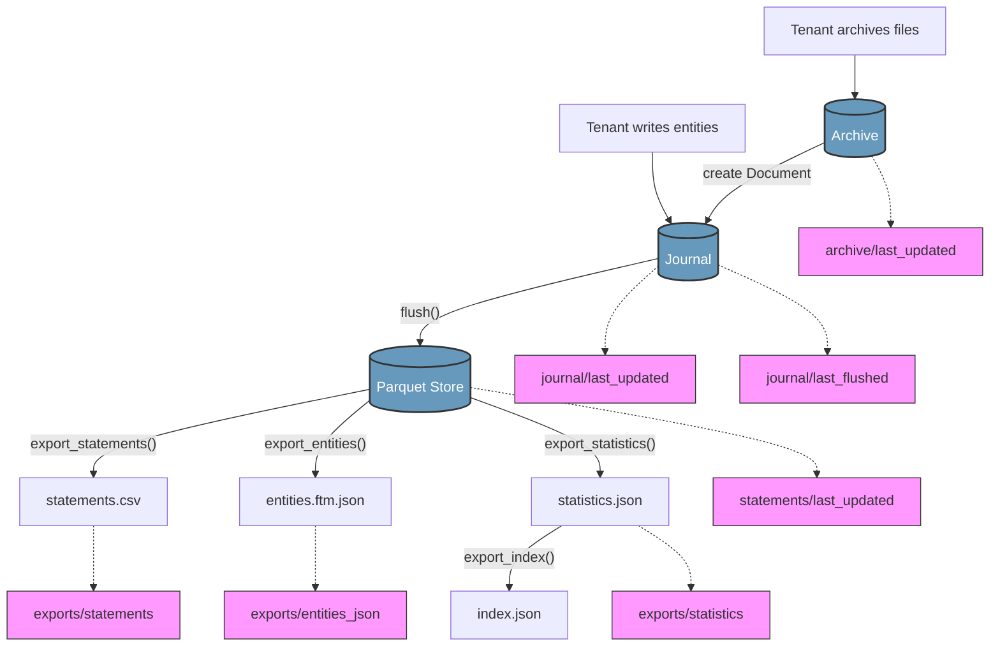

# Core functionality

This section describes the different actions clients (or tenants) can do with the _lakehouse_ and how data altering affects other dependencies under the hood. Applications like [OpenAleph](https://openaleph.org), [investigraph](https://docs.investigraph.dev/) or [memorious](https://docs.investigraph.dev/lib/memorious/) (and your own applications or extensions) are called _Tenants_ in this section. The _lakehouse_ itself is its own tenant, too.

!!! warning
    `ftm-lakehouse` is currently in an early R&D phase. The functionality, dependency chains and path conventions described here may not be in line with the current implementation, and the specification is subject to change. [Read the discussion here](https://aleph.discourse.group/t/rfc-followthemoney-data-lake-specification/276)


## Public interfaces

Tenants can read and write from and to:

- Source files (blob storage and its metadata)
- Entities
- Statements (which form entities)

Tenants can add items individually or in bulk mode (for efficiency). Tenants should not know what side effects an action triggers.

As well, tenants can stream exported `entities.ftm.json` or `statements.csv`.

---

## Source files

A _source file_ is the combination of a raw data blob and its metadata stored alongside it. From the tenant's perspective, a file is identified by a path or URI, not by its checksum. Multiple file paths can reference the same blob, creating multiple metadata entries for a single blob.

### Add a file

**Input:** URI pointing to a local or remote source (must be accessible). Optionally: pre-computed checksum, additional metadata.

**Process:**

1. Compute checksum (or use provided one)
2. Store blob at `archive/{ch[0:2]}/{ch[2:4]}/{ch[4:6]}/{checksum}/data` (skip if exists)
3. Create File metadata object with checksum, path, mimetype, size
4. Store metadata at `archive/{ch[0:2]}/{ch[2:4]}/{ch[4:6]}/{checksum}/{file_id}.json`

**Side effects:**

- Sets `archive/last_updated` tag

**Optional follow-up:** Tenant can request entity creation from the file. If yes, a Document/Pages entity is created from the File metadata and its statements are added to the journal.

### Get a file

**Input:** Checksum

**Output:** File metadata object, or FileNotFoundError

Tenants can then open or stream the blob content.

### Delete a file

**By file_id:** Removes only that specific metadata JSON file.

!!! note
    Currently, blob deletion is not implemented. Only the metadata is deleted.

---

## Entities and statements

Entities are composed of statements. All write operations go through the journal first.

### Add entity

**Input:** EntityProxy object, origin identifier

**Process:**

1. Convert entity to statements
2. Write statements to journal (SQL buffer)

**Side effects:**

- Sets `journal/last_updated` tag

### Add statements directly

Same as add entity - statements are written to the journal.

### Bulk add

**Process:**

1. Open bulk writer with origin
2. Add multiple entities/statements
3. On context exit: commit transaction

**Side effects:**

- Sets `journal/last_updated` tag (once, on exit)

!!! note "Entity deletion"
    Entity and statement deletion from the parquet store is not yet implemented. Statements can be cleared from the journal before flushing.

---

## Query entities

### From statement store (query)

**Input:** Optional filters: entity_ids, origin, and any ftmq Query filters

**Process:**

1. Flush journal to parquet (by default, can be disabled)
2. Query Delta Lake parquet store via DuckDB

**Output:** Generator of StatementEntity objects

### From exported JSON (stream)

**Input:** None

**Output:** Generator of entities from `entities.ftm.json`

Requires prior export. Does not auto-flush.

### Get single entity

**Input:** entity_id, optional origin

**Output:** StatementEntity or None

---

## Mappings

CSV-to-entity transformation configurations.

### Store mapping config

**Input:** DatasetMapping object (contains content_hash, queries)

**Process:**

1. Serialize to YAML
2. Store versioned snapshot
3. Store current config at `mappings/{content_hash}/mapping.yml`

### Process mapping

**Input:** content_hash of source CSV

**Process:**

1. Load mapping config
2. Open source CSV from archive
3. Generate entities via ftm-mapping
4. Write entities to journal with origin `mapping:{content_hash}`

**Side effects:**

- Sets `journal/last_updated` tag
- Sets `mappings/{content_hash}/last_processed` tag

---

## Tags (runtime cache)

Key-value store for freshness tracking and tenant-specific runtime data.

### Tenant usage

Tenants identify themselves (usually by app name) to get a namespace. Tags are tenant-exclusive. To notify other tenants (especially the lakehouse), use the queue.

### Core tags

| Tag | Set by | Meaning |
|-----|--------|---------|
| `journal/last_updated` | Statement writes | Journal has uncommitted data |
| `journal/last_flushed` | Flush operation | Journal was flushed (even if empty) |
| `statements/last_updated` | Flush operation | Parquet store was updated (when data was flushed) |
| `statements/store_optimized` | Optimize operation | Delta Lake files were compacted |
| `archive/last_updated` | File archive | New file was archived |
| `exports/statements` | Export operation | statements.csv was regenerated |
| `exports/entities_json` | Export operation | entities.ftm.json was regenerated |
| `exports/statistics` | Export operation | statistics.json was regenerated |
| `operations/crawl/last_run` | Crawl operation | Last crawl execution timestamp |
| `mappings/{hash}/last_processed` | Mapping operation | Last mapping execution for specific CSV |

### Freshness check

`is_latest(key, dependencies)` returns True if `key` timestamp > all `dependencies` timestamps.

Used to skip unnecessary recomputation. Export operations also check `journal/last_updated` to ensure unflushed data is processed.

---

## Queue

!!! note "Future feature"
    The queue infrastructure exists but is not actively used in current operations. Direct repository calls are used instead.

CRUD action queue for async processing and cross-tenant notifications.

### Purpose

- Notify the lakehouse to perform actions
- Decouple write operations from expensive computations
- Enable async/background processing

### Actions

| Action | Resource | Effect |
|--------|----------|--------|
| UPSERT | entity | Add/update entity in store |
| DELETE | entity | Remove entity from store |
| UPSERT | file | Archive file |
| DELETE | file | Remove file from archive |

### Processing

Queue items are ordered by UUID7 (time-based). Consumers pop items and execute corresponding operations.

---

## Internal operations

These are triggered by the lakehouse, not directly by tenants.

### Flush (journal → parquet)

**Trigger:** Explicit call or automatic before query/export via `ensure_flush()`

**Process:**

1. Read statements from journal ordered by (bucket, origin, canonical_id)
2. Write to Delta Lake parquet partitioned by origin
3. Clear flushed entries from journal

**Side effects:**

- Always sets `journal/last_flushed` tag
- Sets `statements/last_updated` tag (only if data was flushed)

### Optimize (compact parquet files)

**Trigger:** Explicit call

**Process:**

1. Compact small parquet files in Delta Lake
2. Optionally vacuum old file versions

**Side effects:**

- Sets `statements/store_optimized` tag

### Export statements (parquet → CSV)

**Trigger:** Part of make() or explicit call

**Freshness check:** Skip if `exports/statements` > (`statements/last_updated`, `journal/last_updated`)

**Auto-flush:** Calls `ensure_flush()` to flush journal if `journal/last_flushed` < `journal/last_updated`

**Process:**

1. Query all statements via DuckDB
2. Write sorted, deduplicated CSV to `exports/statements.csv`

**Side effects:**

- Sets `exports/statements` tag

### Export entities (parquet → JSON)

**Trigger:** Part of make() or explicit call

**Freshness check:** Skip if `exports/entities_json` > (`statements/last_updated`, `journal/last_updated`)

**Auto-flush:** Calls `ensure_flush()` to flush journal if needed

**Process:**

1. Query parquet store
2. Aggregate statements into entities
3. Write to `entities.ftm.json`

**Side effects:**

- Sets `exports/entities_json` tag

### Export statistics

**Trigger:** Part of make() or explicit call

**Freshness check:** Skip if `exports/statistics` > (`statements/last_updated`, `journal/last_updated`)

**Auto-flush:** Calls `ensure_flush()` to flush journal if needed

**Process:**

1. Compute entity counts, schema distribution from parquet store
2. Write versioned `exports/statistics.json`

**Side effects:**

- Sets `exports/statistics` tag

### Export index

**Trigger:** Explicit call by tenant

**Process:**

1. Ensure flush if needed
2. Optionally export statements.csv, entities.ftm.json, statistics.json
3. Create index.json with dataset metadata and resource links
4. Store versioned copy

---

## Crawl operation

Batch file ingestion from a source location.

**Input:** Source URI, optional filters (prefix, glob, exclude patterns)

**Process:**

1. Create CrawlJob record
2. Iterate source files matching filters
3. For each file:
   - Skip if exists and skip_existing=True
   - Archive file (sets `archive/last_updated`)
   - Create Document entity
   - Write to journal (sets `journal/last_updated`)
4. Update job statistics

**Side effects:**

- Sets `archive/last_updated` tag (per file)
- Sets `journal/last_updated` tag (per file)
- Sets `operations/crawl/last_run` tag
- Creates job run record

---

## Dependency chain



Each export operation:

1. Checks freshness against `statements/last_updated` AND `journal/last_updated`
2. Calls `ensure_flush()` which flushes journal if `journal/last_flushed` < `journal/last_updated`
3. Executes the export
4. Sets its own tag

---

## Storage layout

```
lakehouse/
├── index.json                    # Catalog index
├── config.yml                    # Catalog configuration
├── versions/                     # Versioned catalog snapshots
│   └── YYYY/MM/{timestamp}/
│
└── {dataset}/
    ├── config.yml                # Dataset configuration
    ├── index.json                # Dataset index with statistics
    ├── .LOCK                     # Dataset-wide lock
    │
    ├── archive/                  # Content-addressed file storage
    │   └── {ch[0:2]}/{ch[2:4]}/{ch[4:6]}/{checksum}/
    │       ├── data              # Raw file content (stored once)
    │       ├── {file_id}.json    # File metadata (one per source path)
    │       └── {origin}.txt      # Extracted text (one per engine)
    │
    ├── entities/
    │   └── statements/           # Delta Lake parquet store
    │       └── origin={origin}/
    │           └── *.parquet
    │
    ├── entities.ftm.json         # Aggregated entities export
    │
    ├── mappings/                 # Mapping configurations
    │   └── {content_hash}/
    │       ├── mapping.yml
    │       └── versions/         # Versioned mapping snapshots
    │
    ├── exports/
    │   ├── statements.csv        # Sorted statements export
    │   ├── statistics.json       # Entity counts, facets
    │   └── graph.cypher          # Neo4j export (optional)
    │
    ├── versions/                 # Versioned dataset snapshots
    │   └── YYYY/MM/{timestamp}/
    │       └── {filename}
    │
    ├── locks/{tenant}/           # Operation-specific locks
    │
    ├── tags/{tenant}/            # Freshness tags (workflow state)
    │   └── {key}
    │
    ├── queue/{tenant}/           # CRUD action queue (future)
    │   └── {uuid7}.json
    │
    └── jobs/
        └── runs/                 # Job run records
            └── {job_type}/
                └── {timestamp}.json
```
