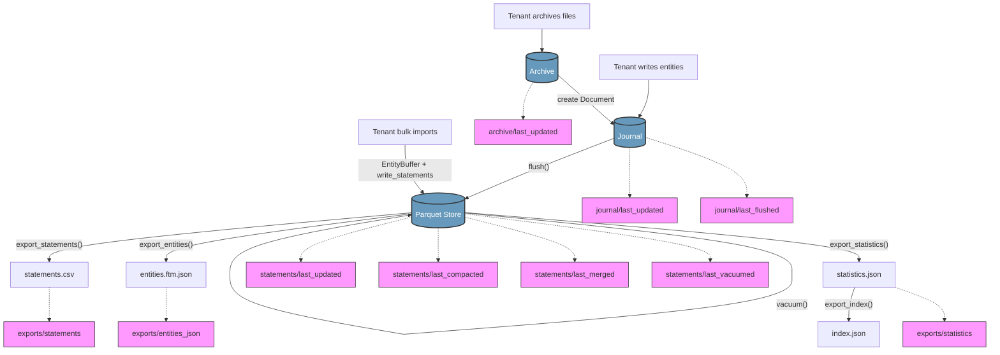

# Core functionality

This section describes the actions that clients (or _tenants_) can perform against the lakehouse and the side effects each action triggers under the hood. Applications like [OpenAleph](https://openaleph.org), [investigraph](https://docs.investigraph.dev/) or [memorious](https://docs.investigraph.dev/lib/memorious/) (and your own applications or extensions) are tenants in this sense. The lakehouse itself is its own tenant, too.

!!! warning
    `ftm-lakehouse` is currently in an early R&D phase. The functionality, dependency chains and path conventions described here may not be in line with the current implementation, and the specification is subject to change. [Read the discussion here](https://aleph.discourse.group/t/rfc-followthemoney-data-lake-specification/276)

## Public interfaces

Tenants can read and write:

- **Source files** (blob storage + metadata)
- **Entities** (FtM)
- **Statements** (the grain entities are stored at)

Add items individually or in bulk. Bulk adders are either journal-backed (crash-safe, deduped within a window) or direct-to-parquet (skip the journal for one-shot loads).

Tenants can also stream the pre-exported `entities.ftm.json` or `statements.csv` files.

---

## Source files

A _source file_ is the combination of a raw data blob and its metadata. A file is identified by a path or URI from the tenant's perspective, not by its checksum. Multiple file paths can reference the same blob, creating multiple metadata entries for one blob.

### Add a file

**Input:** URI pointing to a local or remote source. Optionally: pre-computed checksum and metadata.

**Process:**

1. Compute checksum (or use the provided one).
2. Store the blob at `archive/{ch[0:2]}/{ch[2:4]}/{ch[4:6]}/{checksum}/data` (skip if exists).
3. Create a `File` metadata object with checksum, path, mimetype, size.
4. Store metadata at `archive/{ch[0:2]}/{ch[2:4]}/{ch[4:6]}/{checksum}/{file_id}.json`.

**Side effects:**

- Sets `archive/last_updated` tag.

**Optional follow-up:** create a `Document` / `Pages` entity from the file metadata; its statements are added to the journal.

### Get a file

**Input:** Checksum. **Output:** `File` metadata, or `FileNotFoundError`.

### Delete a file

**By file_id:** removes only that metadata JSON. Blob deletion is not implemented; only metadata is removed.

---

## Entities and statements

Entities are composed of statements. There are two write paths:

1. **Journal-backed** (`writer()` / `add` / `add_many` / `delete_entity` / `delete_statement`) – buffered in a SQL journal, drained to parquet by `flush()`. Crash-safe; deduped within the journal window.
2. **Direct-to-parquet** (`write_statements`) – accepts a shard-sorted stream of `StatementRow` (as produced by `EntityBuffer.flush_buffer()` or `JournalStore.flush_statements()`) and appends per-shard parquet batches. Used by the CLI's `entities import` / `statements import` for one-shot bulk loads.

### Add entity / add statements (journal)

**Input:** `EntityProxy` or `Statement`, origin identifier.

**Process:** convert to statements, write to the journal.

**Side effects:** sets `journal/last_updated` tag.

### Bulk write (journal)

```python
with dataset.entities.writer(origin="import") as writer:
    for entity in entities:
        writer.add_entity(entity)
```

Context-manager commits on exit. Sets `journal/last_updated` tag once.

### Bulk import (direct)

```python
from ftm_lakehouse.logic.entities.buffer import EntityBuffer
buffer = EntityBuffer(dataset.name, dataset.model.shards, origin)
for proxy in entities:
    buffer.add_entity(proxy)
    if len(buffer) >= bulk_size:
        repo.write_statements(buffer.flush_buffer(), now=now)
if buffer:
    repo.write_statements(buffer.flush_buffer(), now=now)
```

Bypasses the journal entirely. Suitable for one-shot loads of large pre-built `entities.ftm.json` files.

### Delete entity

**Input:** `entity_id`.

**Process:** collect statements for the entity from parquet + journal, then write tombstone rows (with `deleted_at` timestamp) back to the journal.

**Side effects:** sets `journal/last_updated`.

On flush, tombstones land as **new rows** in parquet alongside the live rows (append-only writes). `merge` later collapses each `(live, tombstone)` pair to the tombstone (which has a later `last_seen`), then drops the tombstone if `deleted_at < now - grace_period`. Until `merge` runs, the live row is still visible to queries (the view filter is `deleted_at IS NULL` per-row).

### Delete statement

Single-statement tombstone via the journal. Same flow as delete-entity, scoped to one row.

---

## Query entities

### From the statement store (`query`)

**Input:** optional `entity_ids`, `origin`, plus any `ftmq.Query` filters.

**Process:** run a SQLAlchemy `Select` over the Delta table via DuckDB (`delta_scan`). Results are streamed and aggregated into `StatementEntity` objects on the fly.

**Output:** generator of `StatementEntity`.

### From the pre-exported JSON (`stream`)

**Output:** generator of entities read from `entities.ftm.json`. Faster than `query` for full-dataset iteration but requires a prior export.

### Get single entity

`get(entity_id)`. Internally prunes to the entity's shard partition for efficient single-entity lookup.

---

## Mappings

CSV-to-entity transformation configurations.

### Store mapping config

**Input:** `DatasetMapping` (carries `content_hash` and queries).

**Process:** serialise to YAML; store versioned snapshot; store current config at `mappings/{content_hash}/mapping.yml`.

### Process mapping

**Input:** content_hash of a source CSV.

**Process:** load mapping config; open source CSV from the archive; generate entities via ftm-mapping; write entities to the journal with origin `mapping:{content_hash}`.

**Side effects:** sets `journal/last_updated` and `mappings/{content_hash}/last_processed`.

---

## Tags (runtime cache)

Key-value store for freshness tracking and tenant-specific runtime data.

### Core tags

| Tag | Set by | Meaning |
|-----|--------|---------|
| `journal/last_updated` | Statement writes | Journal has uncommitted data |
| `journal/last_flushed` | Flush operation | Journal was flushed |
| `statements/last_updated` | Flush operation | Parquet store was updated |
| `statements/last_compacted` | Compact operation | Parquet files were bin-packed |
| `statements/last_merged` | Merge operation | Per-partition dedup + tombstone reaping ran |
| `statements/last_vacuumed` | Vacuum operation | Obsolete parquet files were deleted |
| `archive/last_updated` | File archive | New file was archived |
| `exports/statements` | Export operation | `statements.csv` was regenerated |
| `exports/entities_json` | Export operation | `entities.ftm.json` was regenerated |
| `exports/statistics` | Export operation | `statistics.json` was regenerated |
| `operations/crawl/last_run` | Crawl operation | Last crawl execution |
| `mappings/{hash}/last_processed` | Mapping operation | Last mapping execution for a specific CSV |

### Freshness check

`is_latest(key, dependencies)` returns `True` if the `key` timestamp is newer than all `dependencies` timestamps. Used to skip unnecessary recomputation in export operations.

---

## Queue

!!! note "Future feature"
    The queue infrastructure exists but isn't actively used in current operations. Direct repository calls are used instead.

---

## Internal operations

### Flush (journal → parquet)

**Trigger:** explicit call.

**Process:**

1. Iterate the journal via `flush_statements()` – yields `StatementRow` ordered by shard.
2. For each shard, accumulate rows into a `pa.Table` matching `SHARDED_SCHEMA`, then call `ParquetStore.append(batch)`, which splits by bucket and writes one parquet file per `(shard, bucket, origin)` partition.
3. Tombstones (rows with `deleted_at`) get their `last_seen` bumped to the delete timestamp so they win the merge tiebreak against the live row they replace.

**Side effects:** sets `journal/last_flushed`, `statements/last_updated`.

**Returns:** number of statements written.

### Compact (cheap bin-pack)

**Trigger:** explicit call.

**Process:** for each `(shard, bucket, origin)` partition, run Delta's `OPTIMIZE compact` to merge small files into larger ones. Does not change row contents.

**Side effects:** sets `statements/last_compacted`. Held under the dataset write fence.

### Merge (expensive per-partition rewrite)

**Trigger:** explicit call.

**Process:** for each `(shard, bucket, origin)` partition, run a DuckDB streaming query that:

- keeps the row with the latest `last_seen` per `id` (`ROW_NUMBER`),
- folds `first_seen` to the minimum across the id-group (`MIN(first_seen) OVER`),
- drops tombstones whose `deleted_at` is older than the grace cutoff,
- writes the result back via `write_deltalake(mode="overwrite", predicate=…)` scoped to that partition.

**Side effects:** sets `statements/last_merged`. Held under the dataset write fence.

### Vacuum

**Trigger:** explicit call.

**Process:** Delta `VACUUM` – deletes parquet files no longer referenced in the Delta log (those tombstoned by `merge` / `compact`).

**Side effects:** sets `statements/last_vacuumed`. Held under the dataset write fence.

### Export statements (parquet → CSV)

**Freshness check:** skip if `exports/statements` newer than `statements/last_updated` and `journal/last_updated`.

**Process:** stream statements from the parquet store via DuckDB; write sorted CSV to `exports/statements.csv`.

**Side effects:** sets `exports/statements`.

### Export entities (parquet → JSON)

Same shape as export-statements but aggregates statements into entities and writes `entities.ftm.json`. Sets `exports/entities_json`.

### Export statistics

Computes entity counts and schema distribution; writes versioned `exports/statistics.json`. Sets `exports/statistics`.

### Export index

Ensures flush, optionally runs the other exports, writes `index.json` with dataset metadata and resource links, stores a versioned copy.

---

## Crawl operation

Batch file ingestion from a source location.

**Input:** source URI, optional filters (prefix, glob, exclude patterns).

**Process:** iterate matching files; per file archive the blob, create a `Document` entity, write it to the journal.

**Side effects:** sets `archive/last_updated`, `journal/last_updated`, `operations/crawl/last_run`. Creates a job run record.

---

## Dependency chain


```mermaid
flowchart TD
    A[Tenant writes entities] --> B[(Journal)]
    A2[Tenant archives files] --> AR[(Archive)]
    AR -.-> T0[archive/last_updated]
    AR --> |"create Document"| B

    B --> |"flush()"| C[(Parquet Store)]
    A3[Tenant bulk imports] --> |"EntityBuffer + write_statements"| C

    C --> |"merge()"| C
    C --> |"compact()"| C
    C --> |"vacuum()"| C

    C --> |"export_statements()"| D[statements.csv]
    C --> |"export_entities()"| E[entities.ftm.json]
    C --> |"export_statistics()"| F[statistics.json]
    F --> |"export_index()"| G[index.json]

    B -.-> T1[journal/last_updated]
    B -.-> T1b[journal/last_flushed]
    C -.-> T2[statements/last_updated]
    C -.-> T2a[statements/last_compacted]
    C -.-> T2b[statements/last_merged]
    C -.-> T2c[statements/last_vacuumed]
    D -.-> T3[exports/statements]
    E -.-> T4[exports/entities_json]
    F -.-> T5[exports/statistics]

    classDef tag fill:#f9f,stroke:#333,stroke-width:1px
    classDef storage fill:#69b,stroke:#333,stroke-width:2px,color:#fff
    class T0,T1,T1b,T2,T2a,T2b,T2c,T3,T4,T5 tag
    class B,C,AR storage
```

---

## Storage layout

```
lakehouse/
├── index.json                    # Catalog index
├── config.yml                    # Catalog configuration
├── versions/                     # Versioned catalog snapshots
│   └── YYYY/MM/{timestamp}/
│
└── {dataset}/
    ├── config.yml                # Dataset configuration (incl. `shards: N`)
    ├── index.json                # Dataset index with statistics
    ├── .LOCK                     # Dataset-wide write fence
    │
    ├── archive/                  # Content-addressed file storage
    │   └── {ch[0:2]}/{ch[2:4]}/{ch[4:6]}/{checksum}/
    │       ├── data              # Raw file content (stored once)
    │       ├── {file_id}.json    # File metadata (one per source path)
    │       └── {origin}.txt      # Extracted text (one per engine)
    │
    ├── entities/
    │   └── statements/           # Delta Lake parquet store
    │       ├── _delta_log/
    │       └── shard={hex}/bucket={bucket}/origin={origin}/*.parquet
    │
    ├── entities.ftm.json         # Aggregated entities export
    │
    ├── mappings/                 # Mapping configurations
    │   └── {content_hash}/
    │       ├── mapping.yml
    │       └── versions/
    │
    ├── exports/
    │   ├── statements.csv        # Sorted statements export
    │   ├── statistics.json       # Entity counts, facets
    │   ├── documents.csv         # Document metadata
    │   └── graph.cypher          # Neo4j export (optional)
    │
    ├── versions/                 # Versioned dataset snapshots
    │   └── YYYY/MM/{timestamp}/
    │
    ├── tags/{tenant}/            # Freshness tags (workflow state)
    │
    ├── queue/{tenant}/           # CRUD action queue (future)
    │
    └── jobs/
        └── runs/{job_type}/{timestamp}.json
```
